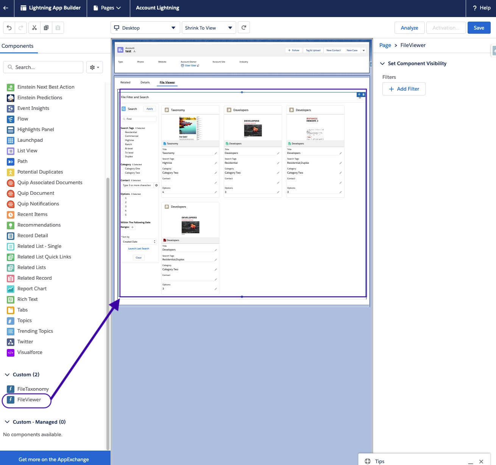

# firmworks FileViewer

View page here [https://firmworks.github.io/FileViewer/](https://firmworks.github.io/fileviewer/)

File Viewer is a native salesforce application designed to make the storing, retrieving and editing of Content faster and easier.

- [Features](#Features)
- [Post Install Config](#Post-Install-Config)

## Features

Easily Tag Files As They are Uploaded

Search driven by your companies values

## Post Install Config

1. Add the 'Tag and Upload' Global Action to the Global layout or to the layout of any Object

    

1. Add the Lightning Component "File Viewer" to any lightning Record Page Layout to get a contextual view of related content.

    

1. Curate Viewer fields by adding custom fields onto the ContentVersion Object to control tagging and searchable. Add picklists, multipicklists, lookup fields, and others to help define the shape of the documents.
    

1. Give users permissions to the Viewer fields and the permission set for 'FileViewer'.

1. Discover and work with files through the File Viewer tab.

1. Add taxonomy launcher to any layout to get users to tag files as they upload them.
    

# Visit Us

https://getfirmworks.com

support@getfirmworks.com
