[Documentation](index.md)

# Additional Setup

- [Additional Optional Setup](#additional-optional-setup)
   - [Assigning the Default Tab to Apps](#assigning-the-default-tab-to-apps)
   - [Creating a new FileViewer Tab](#creating-a-new-fileviewer-tab)
   - [Configuring a Record Page Layout](#configuring-a-record-page-layout)
      - [File Tag Launcher](#file-tag-launcher)
      - [File Tagger](#file-tagger)
      - [FileViewer](#fileviewer)
   - [Setting up a FileViewer Configuration Metadata Record](#setting-up-a-fileviewer-configuration-metadata-record)
   - [Configuration for Experience Page](#configuration-for-experience-page)
- [Component Appendix](#component-appendix)
   - [FileViewer Appendix](#fileviewer-appendix)
   - [File Tag Launcher Appendix](#file-tag-launcher-appendix)

### Modifying Display Fields in FileViewer Quick Action

In order to modify display fields on the Quick Action you must create a configuration with the field you want to see. The configuration name needs to match the object API name as it is in Salesforce. EX. Account is Account, Custom Object A is Custom_Object_A__c. See [Setting up a FileViewer Configuration Metadata Record](#setting-up-a-file-viewer-configuration-metadata-record) for more information on setting up a configuration.

Here is an example record build on the Account with custom tags added:
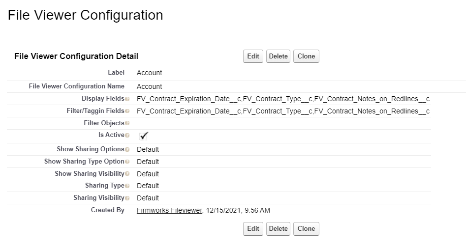

### Assigning the Default Tab to Apps

1. To add the default File view tab to other Salesforce apps, navigate to Salesforce Setup -> App Manager -> click edit on the app you want to add the tab to.

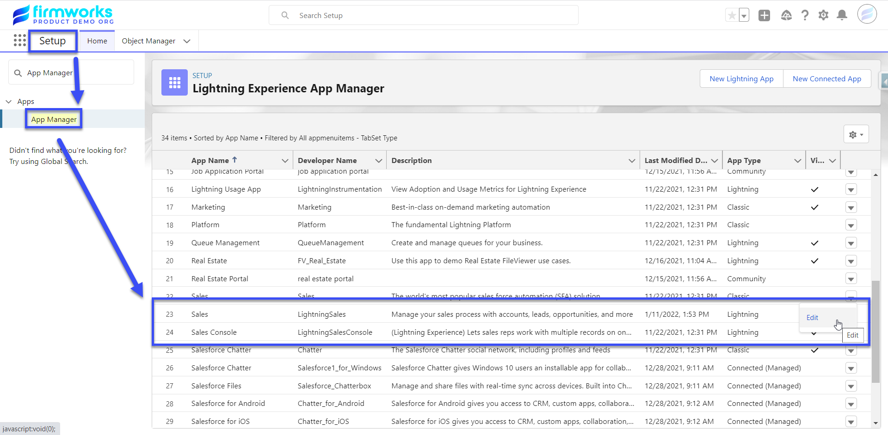

1. Once in the App Settings click on Navigation Items and find the FileViewer tab on the left and move it to the right then click save.

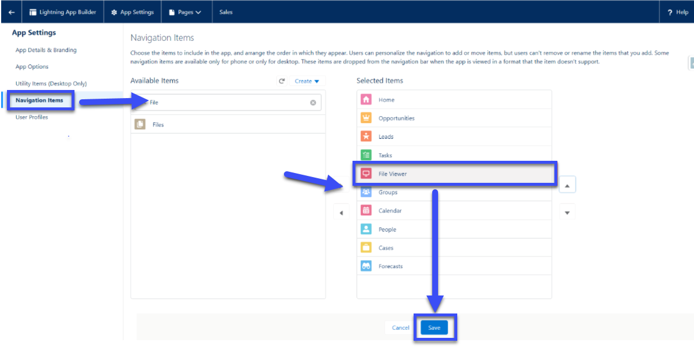

### Creating a new FileViewer Tab

1. To Create a new FileViewer tab, go to Salesforce Setup -> Tabs -> Lighting Component Tabs. Then Choose one of the two FileViewer components that you want to see in the tab, then click next to assign profiles and apps to the new tab.

   firmworks:fileviewer is the Component you see in the Default FileViewer Tab

   firmworks:filetaxonomylauncher is a UI for tagging and uploading new documents. For more please see the Component Overview section of this document.

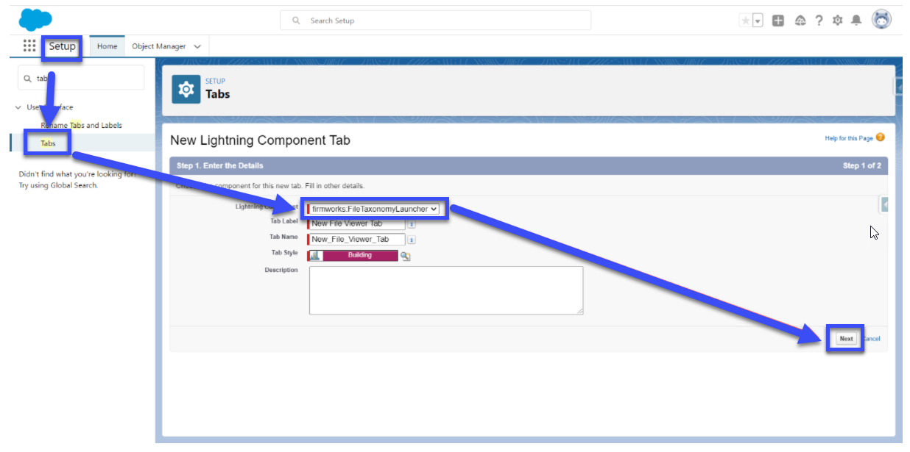

 1. Once you save the action add it to the page layout using the Page Layouts section of the Object Manager.

### Configuring a Record Page Layout

You can add any of the following components to a page layout. Each Component has a series of Design Options you can use to customize each Component. To see the design layout use the [Component Appendix](#Component Appendix).

#### **Content Viewer**

1. Configuration: 

   1. Content Version Id - Set a Salesforce Content Version Id here to show it in the Component. To get the Content Version Id, please use the following SOQL in Workbench or Developer Console:

> SELECT Id FROM ContentVersion WHERE ContentDocumentId = '<***Insert The Salesforce File Id you want to show in the component here***>'

#### **File Report Results**

1. Appearance:

   1. Title - This will set the title in the top left of the component on the page layout.

   1. Max Height - This will set the max height on the component on the page layout. If this is not set the height will be set based on the number of returned results.

1. Configuration:

   1. Report Name - This is a pick list of all the File Reports on the org for an admin to choose from. To create a new report please review the [File Reporting](file-reporting.md) section of the documentation.

1. Behavior:

   1. Auto Run On Load - When this option is checked the report will run when the page loads. This could cause slow downs if the report returns a large amount of records. When this is not checked a user will need to click the reload report icon on the top right of the component to see results.

#### **File Report Runner for Records**
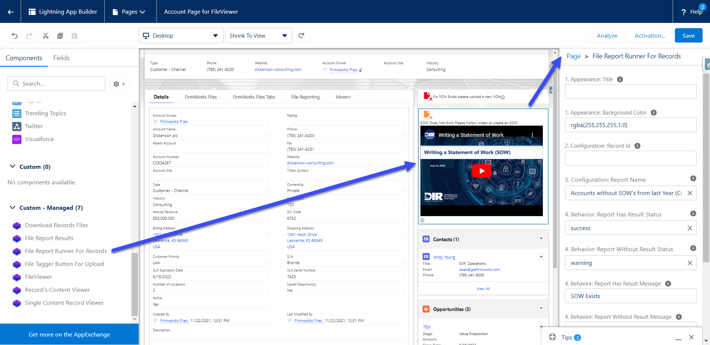

1. Appearance:

   1. Title - This will set the title in the top of the component on the page layout.
   1. Background Color - This will allow you to change th3 color of the component's background to better match your branding or make messages more legible.

1. Configuration:

   1. Record Id - This is used in Experience to set the Record Id for the component to run. Use {!recordId} to pass in the current records Id for context.
   1. Report Name - This is a pick list of all the File Reports on the org for an admin to choose from. To create a new report please review the [File Reporting](file-reporting.md) section of the documentation.

1. Behavior:

   1. Report Has Results Status - This is a list of display options to let the configurator decide how the Icon should look when a record is found in the report associated in the Report Name.
   1. Report Without Results Status - This is a list of display options to let the configurator decide how the Icon should look when a record is NOT found in the report associated in the Report Name.
   1. Report Has Results Message - This is a Text field to let the configurator decide how the message should look when a record is found in the report associated in the Report Name. This also also allows for Rich Text, so a configurator can use links, images, and to guide users on how to make the records compliant. 
   1. Report Without Results Message - This is a Text field to let the configurator decide how the message should look when a record is NOT found in the report associated in the Report Name. This also also allows for Rich Text, so a configurator can use links, images, and to guide users on how to make the records compliant.
   1. Display Results Documents - If this is checked it will show a button to allow the user to see the documents that were uploaded that allowed the record to be included in the report. If it is not checked it will not show the button. 
   1. No Action Message - This is a Text field to let the configurator decide how the message should look when a record is not part of the object filter criteria for the report associated in Report Name.

   An example of how this component works in practice:
   

   Some examples of how rich text can be used in the Message configuration fields:
   

   Some Rich Text Examples:  
    `<a href="www.google.com">Here is a Hyperlink</a>  `

   Here is an image:  
   `  `

   Here is a Video:  
   `<iframe width="560" height="315" src="https://www.youtube.com/embed/EO1Z-sNx_bs" title="YouTube video player" frameborder="0" allow="accelerometer; autoplay; clipboard-write; encrypted-media; gyroscope; picture-in-picture" allowfullscreen></iframe>`

#### **File Tag Launcher**

1. Setup:

   1. Record Id - This section will allow you to pass in a record into give the component context do the record page it is on.

1. Button:

   1. Label – The label for the Button

   1. Appearance – This allows you to define the style of the button using SLDS Button Design types.

   1. Horizontal Location - The location of the button across the page

   1. Vertical Location - The location of the button in the from top to bottom

1. Tagger:

   1. Launched Screens Title - The title of the UI component once the button is clicked

   1. Configuration Name – The name of the FileViewer Configurations Metadata record you want to use to source your tag launcher screen

   1. Filter Fields - A comma delimited list of Content Version fields you want to filter by.

   1. Allowed File Types – a comma delimited list of file types the user is allowed to upload.

   1. Allow Multiple Documents - This box will allow the user to upload multiple documents with oud having to close and reopen the UI.

   1. Tagger Sharing:

      1. Show Sharing Options - Toggle this to show or hide all sharing options.

      1. Show Sharing Visibility – Toggle this to show and hide Share with experience Users Toggle

      1. Show Sharing Type – Toggle this show and hide the Enhanced record access toggle.

      1. Sharing Type – This will default the Sharing type regardless of if Show Sharing type is true.

         1. If set to I the toggle will default to Record.

         1. If set to V the toggle will default to Viewer.

      1. Sharing Visibility – This will allow you to default the Sharing Options regardless of if Show Sharing Options is true

         1. AllUsers – Defaults the toggle to All Users

         1. InternalUsers – Defaults the toggle to Default

<!--#### **File Tagger**

1. Setup:

   1. Record Id - This section will allow you to pass in a record id to give the component context do the record page it is on.

1. Configuration:

   1. Allowed File Types – a comma delimited list of file types the user is allowed to upload.

   1. Configuration Name – The name of the FileViewer Configurations Metadata record you want to use to source your tagger screen

   1. Allow Multiple Documents - This box will allow the user to upload multiple documents with oud having to close and reopen the UI.

   1. Filter Fields - A comma delimited list of Content Version fields you want to use to tag the File.

   1. Show Sharing Options - Toggle this to show or hide all sharing options.

   1. Show Sharing Visibility – Toggle this to show and hide Share with experience users toggle

   1. Show Sharing Type – Toggle this show and hide the Enhanced record access toggle.

   1. Sharing Type – This will default the Sharing type regardless of Show Sharing type being true.

      1. 1. I - Defaults the toggle to Record.

      1. V - Defaults the toggle to Viewer.

   1. Sharing Visibility – This will allow you to default the Sharing Options regardless of Show Sharing Options being true.

      1. AllUsers – Defaults the toggle to All Users

      1. InternalUsers – Defaults the toggle to Default-->

#### **FileViewer**

1. Appearance:

   1. Title – The title for the component

   1. Background Color – The rgba color designation for the background color of the component

   1. Search Panel Option – Defining default behaviors for Show/Hiding the Search Panel

      1. User – Tracks the last state of the panel based on the user’s preference

      1. Hidden – Removes the ability to search

      1. On - Toggles search panel on by default

      1. Off – Toggles search panel off by default

1. Configuration:

   1. Record Id – Use this to give context to the component so it only shows records related to the provided record Id.

   1. Name - The name of the FileViewer Configurations Metadata record you want to use to source your viewer screen

   1. Search Objects – Comma delimited list of objects the user can search against

   1. Filter Objects - Comma delimited list of objects the user can filter against

   1. Display Fields - Comma delimited list of content version fields to display

   1. Filter Fields - Comma delimited list of content version fields to filter against

1. Behavior:

   1. Cache Id – If you want the behavior to be different between instances of the file's viewer. Use this variable to a unique variable or name to reference the way you have the component set up in each place. If you have the component set up on the account a very specific, you want to use for every object, use the cache id to not have to setup all the settings again.

#### **Record Content Viewer**
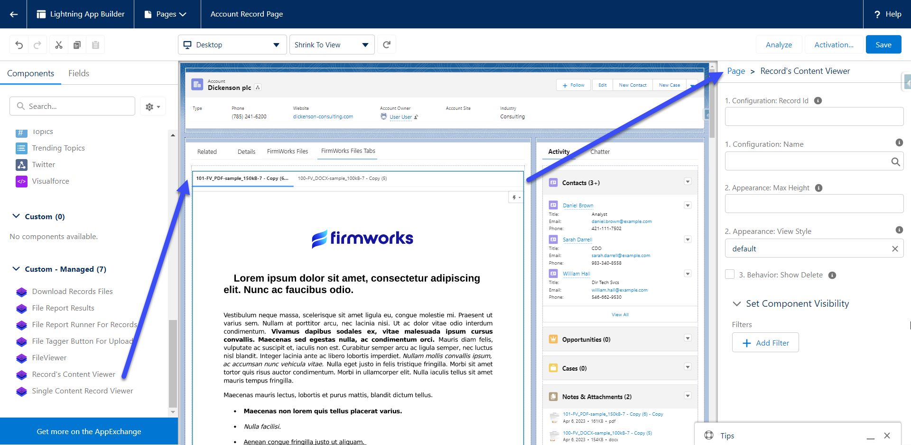

1. Configuration:

   1. Record Id - This is used in Experience to set the Record Id for the component to run. Use {!recordId} to pass in the current records Id for context.

1. Appearance:

   1. Max Height - This will set the max height on the component on the page layout. If this is not set the height will be set based on the number of returned results.

### **Setting up a FileViewer Configuration**
If you want to use the same configuration for more than one use of the component you can create a FileViewer Configuration. In the App Finder type 'Configurator', and select the FileViewer Configurator tab. In order to see this tab a user must have the FileViewer Configuator permission set. To assign a permission set please follow the documentation from Salesforce (https://help.salesforce.com/s/articleView?id=sf.perm_sets_assigning.htm).

#### Configuration Naming

To create a new Configuration click Add New Configuration on the top right of the app. Click the Configuration to expand it and see the settings. Always start off by giving your configuration a name and deciding if it should be active or inactive.

Use the following two Configuration naming conventions to set defaults for various locations in Salesforce:

1. Object Name verbatim will set that configuration as the default configuration for any of that objects page layouts. Here are some examples:

   Naming the Configuration Account will make that configuration the default when <NONE> is selected for the 2b. Configuration Name Design Element on an Account page.

   If there was a custom object named Custom_Object__c, naming the Configuration Custom_Object__c configuration would do that same for the Custom_Object__C page.

1. Object Name in all lower case will set that configuration as the default for the Experience Detail Page for that Object. Here are some examples:

Naming the Configuration account will make that configuration the default when <NONE> is selected for the 2b. Configuration Name Design Element on an Account Detail page in the experience.

If there was a custom object named Custom_Object__c, naming the Configuration custom_object__c configuration would do that same for the Custom_Object__C page.

Regardless of the Configuration name you will see them in the 2b Configuration Name Drop down in the component design.

#### Field Options

In this section you can choose tags from the Content Version you want to include as Display Fields and/or Filter Fields, in addition to filter Object. To Add one or more items to the configuration, click an item then use the right pointing arrow to move it to the Selected Section.

Filter Fields and Filter Objects only apply when the configuration is applied to the FileViewer Component.

#### Field Values

In this section you can set predefined values that will be applied when the component this configuration is used for uploads a file. Select a tag from the drop down list and type the default value you want to set in the entry that appears to the right.

#### Sharing and Visibility Options

Here you can set which sharing and visibility options the component will use. For more on these options please see the configuration section of the [File Tag Launcher](#file-tag-launcher).

Once the Configuration settings are established click the save button on the top right of the Configuration header.

This will start to deploy the configuration. Once it is completed the status will change to the following.

Once created reference the FileViewer Configuration Name in the components Configuration Name design element by choosing it from the picklist.

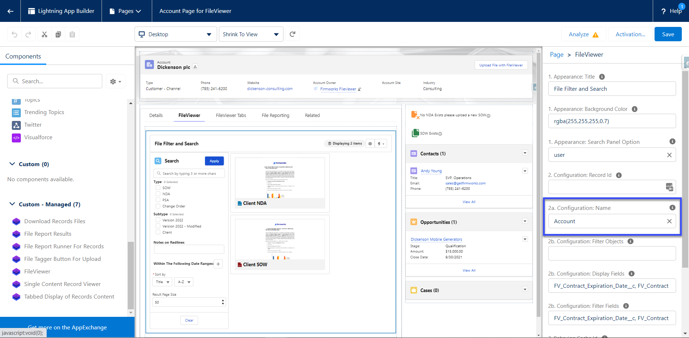

### **Configuration for Experience Page**

This section will require an active Experience to setup. See more documentation on setting up an Experience from Salesforce [https://help.salesforce.com/s/articleView?id=sf.networks_setup_maintain_communities.htm](https://help.salesforce.com/s/articleView?id=sf.networks_setup_maintain_communities.htm&type=5).

Open the Experience Builder from Salesforce Setup, navigate to the Experience page you want to add the component, open the Components menu on the right, then navigate to the Custom Components Section. From here you can drag either the File View or File Tag Launcher Component onto the Experience page.

From here you can follow the [Configuring a Record Page Layout](#configuring-a-record-page-layout) section above to configure the components.

You will need to share the following apex classes with your Experience user profile in order for the users to upload files:

- firmworks.FileTaxonomyController

- firmworks.ObjectFinderController

- firmworks.FileViewerController

- firmworks.ContentViewerController

- firmworks.RecordReportController

## **Component Appendix**

#### **FileViewer Appendix**

1. Search Section: The topmost bar will allow you to search any of the object allowed to be search from the setup of the component. If Search Objects was left blank it will search all objects. The Apply button will apply any search elements defined in the search section.

   1. Each tag is shown in the search section filter documents. Check the boxes for the tags you want to filter on the click Apply.

   1. Clicking the + button below the ‘Within The Following Date Ranges:’ section will result in a date filter section being added.
   

   1. This allows you to use the date fields on the Content Version to filter. If you choose Custom range, you will be given a date picker UI to choose the dates.

      

      This can be added multiple times. Once you add dates to filter on click the Apply button.

   1. Sort By will allow you to sort the searched files by the chosen field

   1. Max results limits the number of results per page by the chosen number

1. Results Section: This is the files returned by your search results. Each tile is set up the same way. Clicking one of the edit panels will allow the user to edit the file.

   1. Preview of the Document

   1. Title of the document

   1. All tags on the Content Document object

1. This gear represents the FileViewer advanced settings. Clicking it will reveal the following menu.

   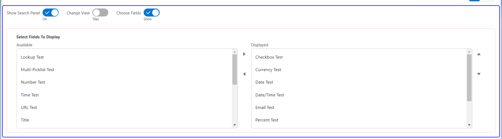

   1. Show Search Panel (On/Off) - This allows for a user to show and hide the search panel. By default the search panel is shown.

   1. Change View (Tiles/List) - This allows for a user to toggle between seeing files as tiles or seeing files in a list.

   1. Choose Fields (Show/Hide) -  This allows for a user to see a list of Displayed fields. It also allows users to modify their view to show specific tags they are interested in. Changing displayed fields does not affect FileViewers ability to filter on those fields. To reset displayed fields click the "i" icon shown below.

      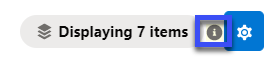

1. The Lightning bolt represents the actions you cna take from the FileViewer Component

   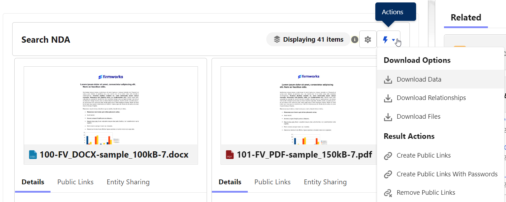

   1. Download Data - This button will download an Excel sheet for all displayed Files. The Excel sheet shows a list of all the file field values for those files.

   1. Download Relationships - This button will download an Excel sheet containing the Content Document Id and Linked Entity Details, such as a Object Name, Record name, and Record Id.

   1. Download Files -  This button will download a zip file containing all the displayed files.

#### **File Tag Launcher Appendix**

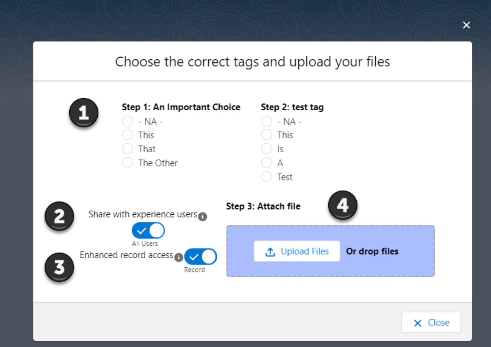

When using this UI please make sure you follow the steps in order (1 -> 2 -> 3) to make sure tagging and sharing works correctly with each file.

1. This Section Shows you the Tags they can be associated with the files uploaded. Make sure to set your tags before you upload the file. Tags can be left the same between upload or changed. If you use the Upload Files button the set tags will be associated with all files uploaded.

1. This section allows for the user to decide if the uploaded files should be shared with all users (All Users) or only internal users (Default). This works on a per file bases if drag drop is used or with multiple files if using the Upload Files button.

1. This Section allows for the user to decide if they want to have the files shared with inferred sharing from the related records (Record) or only if the file should be view only to people with record access (viewer). This works on a per file bases if drag drop is used or with multiple files if using the Upload Files button.

1. This is the section where you literally upload the files. You can drag drop one file at a time or click the upload files button to upload multiple files.
