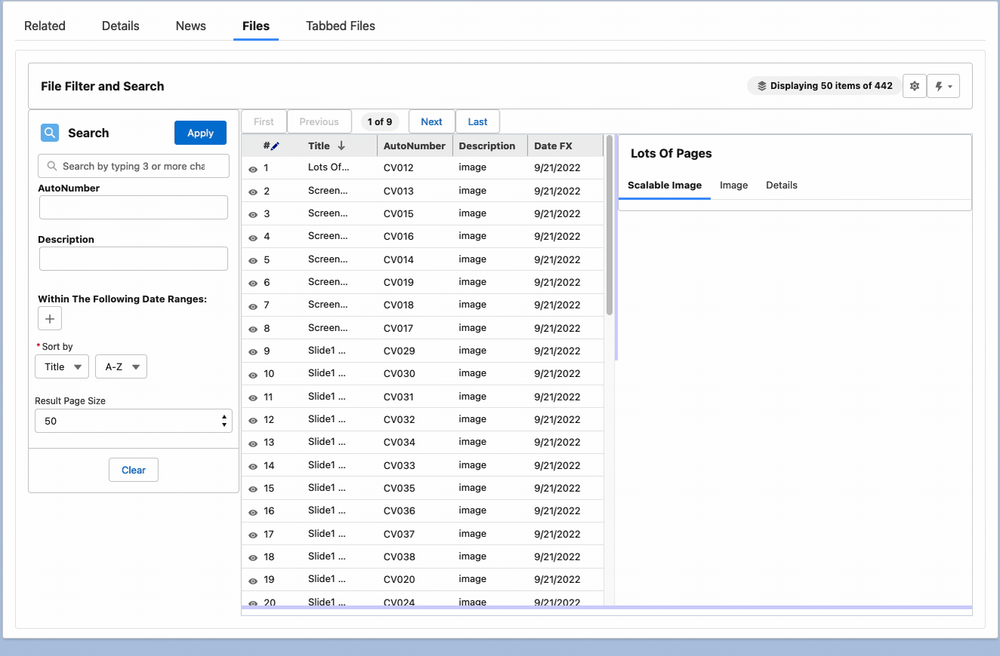
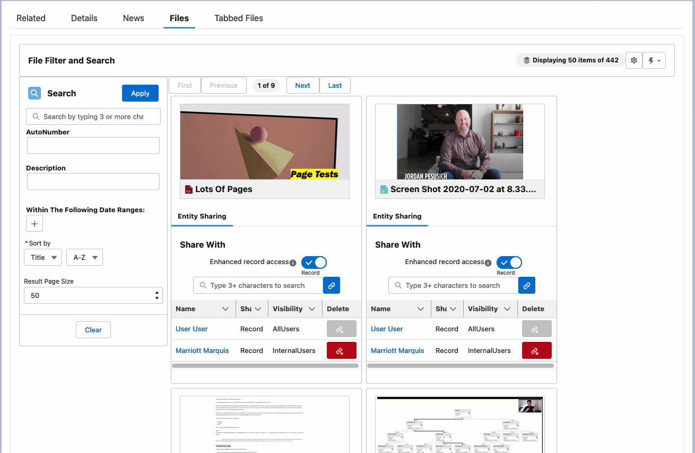
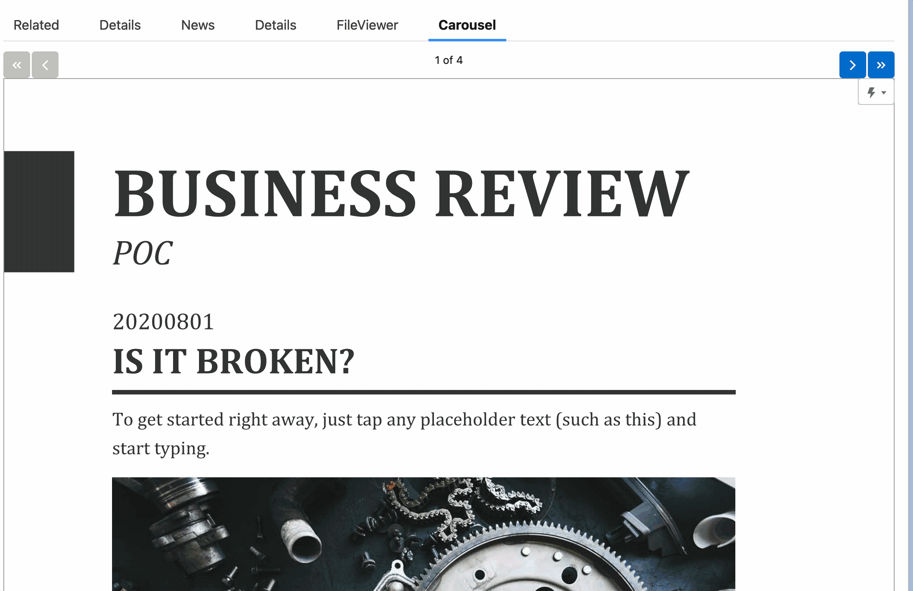
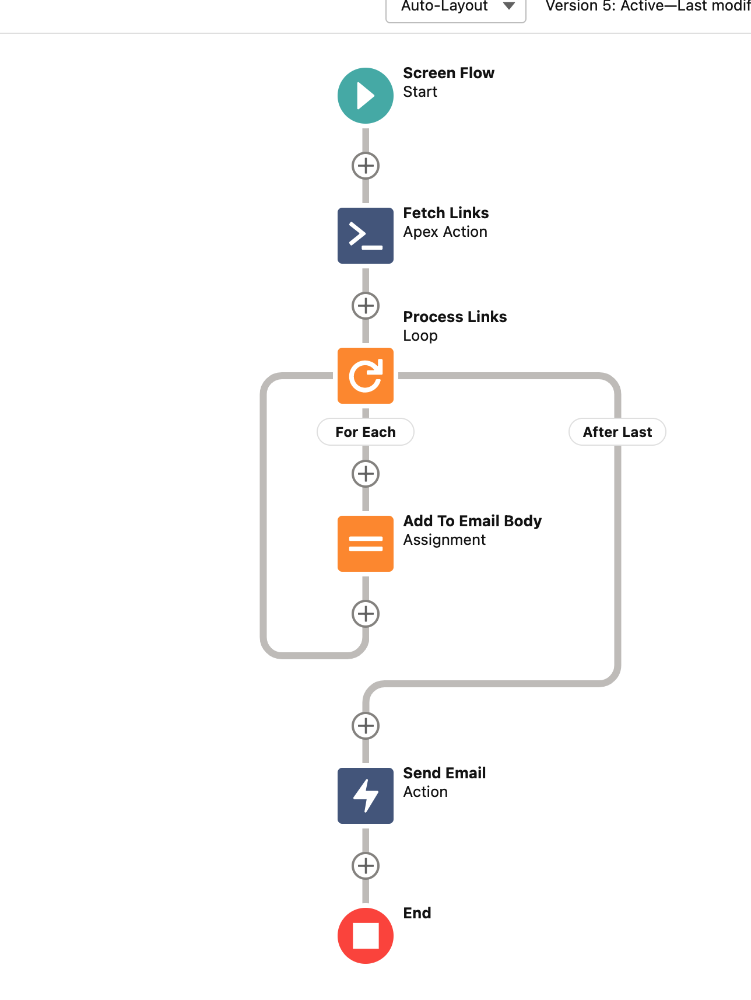
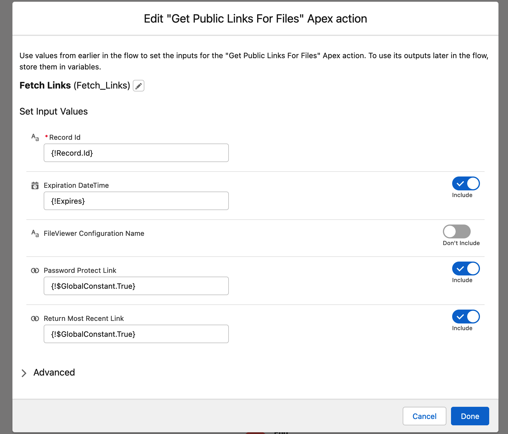
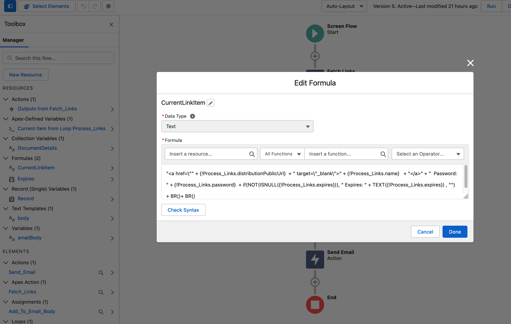
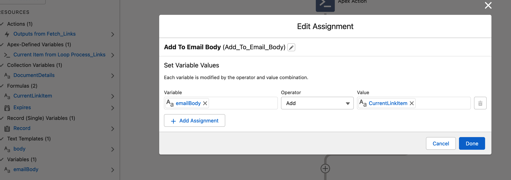
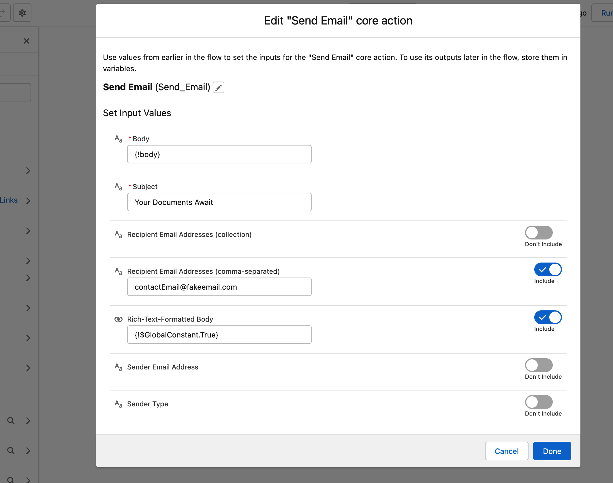
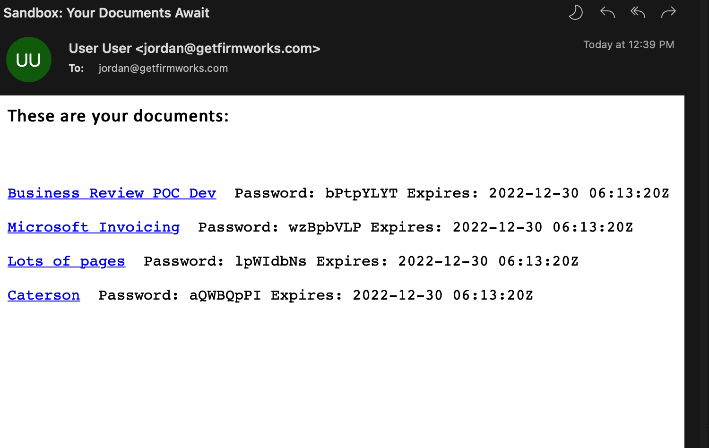

[Documentation](index.md)

# Features

1. [Upload and Tag](#upload-and-tag)
1. [Search and Filter](#search-and-filter)
1. [View on Record](#view-on-record)
1. [Resizable Preview](#resizable-previews)
1. [Public Link Management](#public-link-management)
1. [Enhanced Entity Sharing Management](#enhanced-entity-sharing-management)
1. [Bulk Upload](#bulk-upload)
1. [Tag and Update Existing Documents Quickly](#tag-and-update-existing-documents-quickly-and-easily)
1. [Multi file Viewer](#tabbed-viewer)
1. [Powerful File Reporting](#file-reporting)
1. [File Auditing and Compliance](#file-auditing-and-compliance)
1. [Record Reports](#record-reports)
1. [Public Link Flow Action](#flow-action-public-links)

## Upload And Tag

Easily Tag Files As They are Uploaded


## Search and Filter

Driven by your organizations's values


## View on Record

View image, pdf and doc files directly on the record without navigating away


## Resizable Previews

Resize the viewing pane directly on the layout to read the fine print.


## Public Link Management

Create, Delete, View Content Public links easily to provide external users access. Enhances default public link experience by giving users the option to use passwords to protect links. Delete public links easily to redact access.



## Enhanced Entity Sharing Management

Create, Delete, View Content Document Link records directly on the layout. Easily create links to any object record in Salesforce more than just users.



## Bulk Upload

Upload hundreds if not thousands of files at once


## Tag and Update Existing Documents Quickly and Easily

Quickly and easily work with your existing files and documents to give them the metadata they need to report, find, sort, and work with them going forward. With support to use the last edited value to quickly update files.


## Tabbed Viewer

Load viewable file content directly on the screen so users do not have to navigate away from the record they are on.




## File Reporting

Report on files and their field values - something not currently available in Salesforce

This example looks for all Accounts where an opportunity has been set to Closed Won within the last fiscal quarter, that also have a file title with 'MSA' in it (we recommend using picklists in practice). The power here is that not only can you find Accounts in Compliance with your legal standards - you can quickly find Accounts that are OUT of compliance as well by switching to Records without documents.


## File Auditing and Compliance

Reports can be built to your exacting requirements and scheduled to run on your schedule. Scheduled reports produce Salesforce Platform Events that can be used to drive the behavior and activities required to keep your company in compliance.


## Record Reports

Save a report and drop a component on a layout to help alert your users if documentation is missing.

## Flow Action Public Links



Using Salesforce Flows you can create public links to add into emails.
There are numerous reasons why providing links to content is preferrable to sending the files directly.



- Record Id Can be any record ID - Use Content Document Id or Content Version Id to generate public links for individual files. Use any object id to create multiple public links - use FileViewer Configuration Name to create a filter on which files to use for an object.
- Expiration DateTime - Use to create an expiration DateTime of when the links will expire.
- Password Protect Link - True/False if Salesforce should generate a password to access the shared file.
- Return Most Recent Link - True/False if public links already exists for the file, return the latest one to use instead of generating a new one.

### Loop the results and build your links

As an example requesting the files for an Account - Looping over the links and appending them to an email body.

#### Create a formula variable to format the results


```text
"<a href=\"" + {!Process_Links.distributionPublicUrl}  + " target=\"_blank\">" + {!Process_Links.name}   + "</a>" + "  Password: " + {!Process_Links.password}  + if(NOT(ISNULL({!Process_Links.expires})), " Expires: " + TEXT({!Process_Links.expires}) , "") + BR()+ BR()
```

#### Concatenating/Adding the value in the loop to build a variable full of links



#### Creating the Send Email Action



#### Resulting Email


