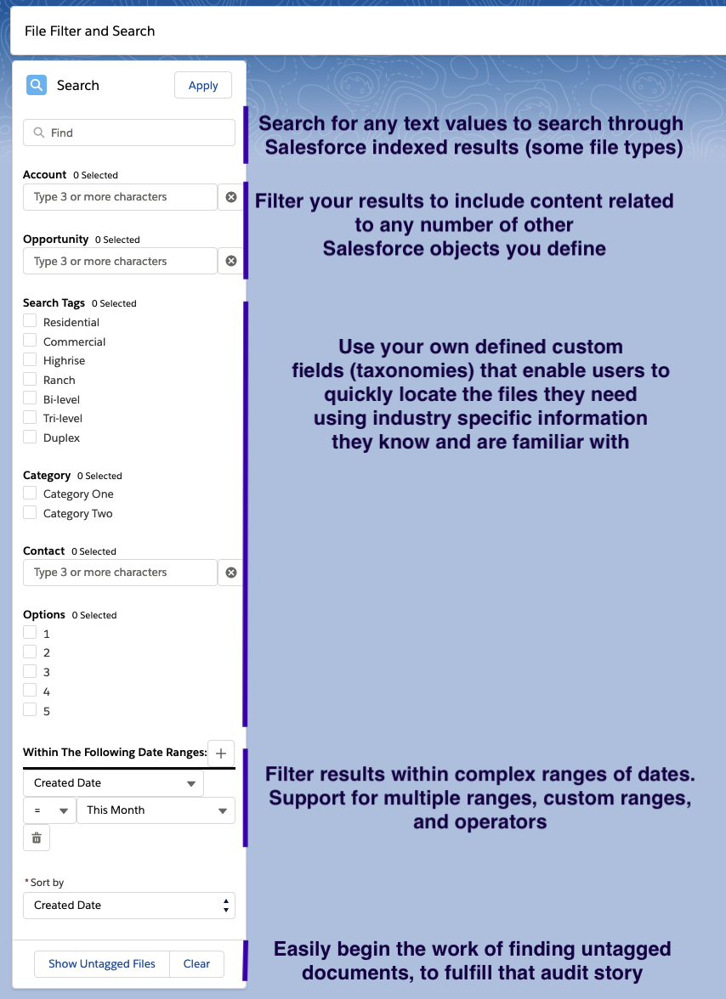
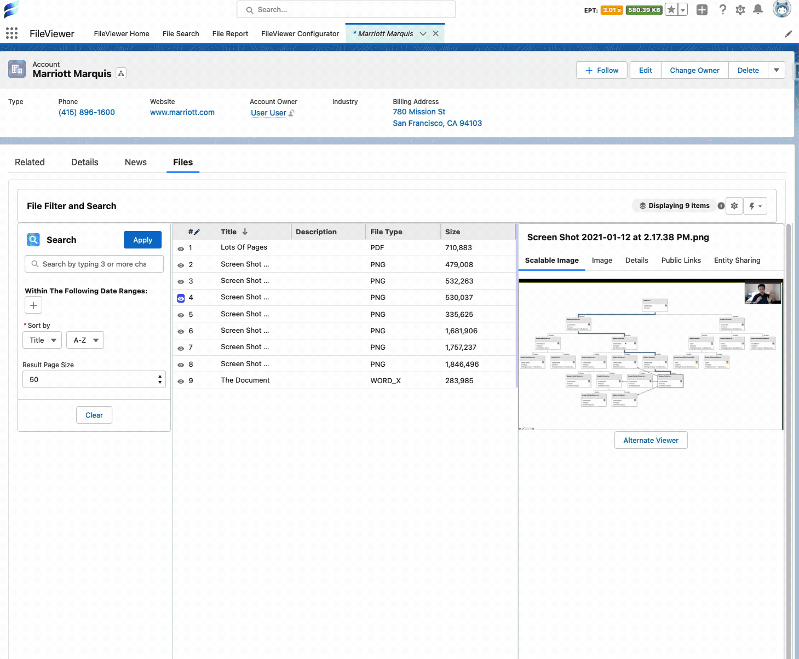
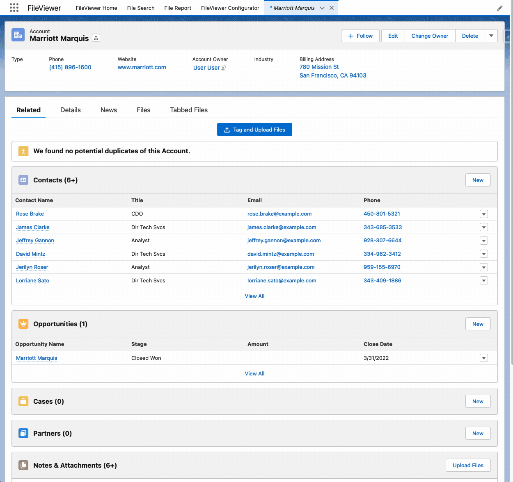
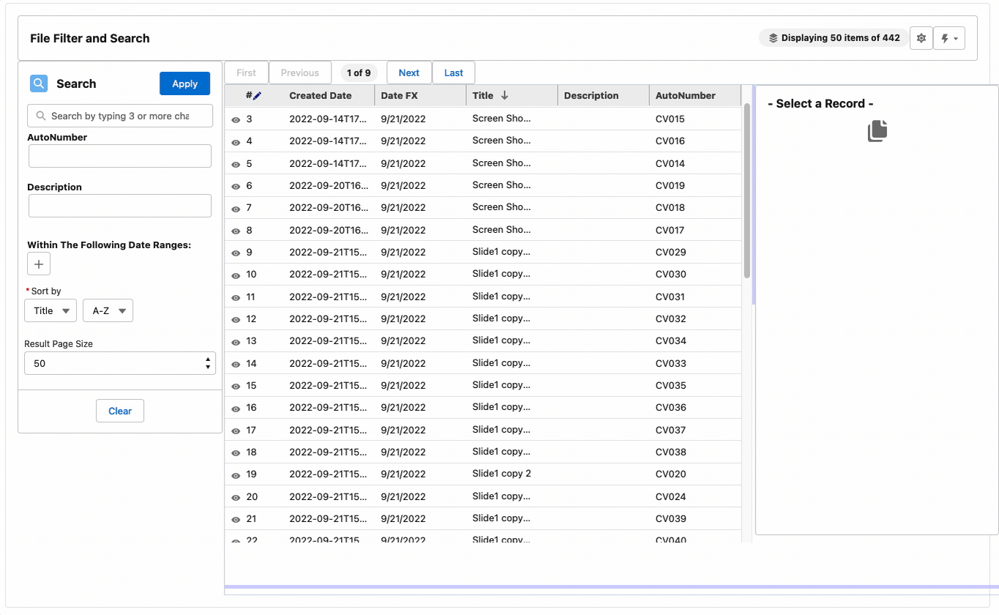
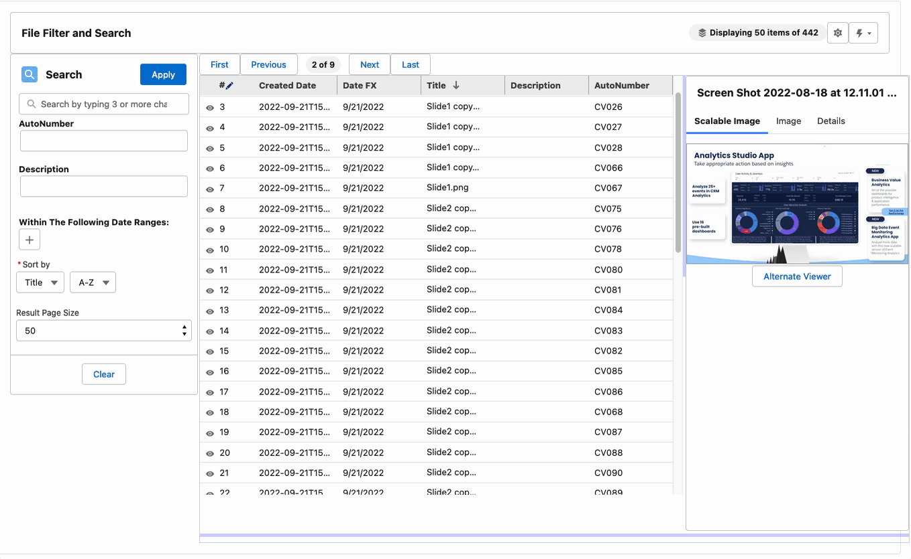
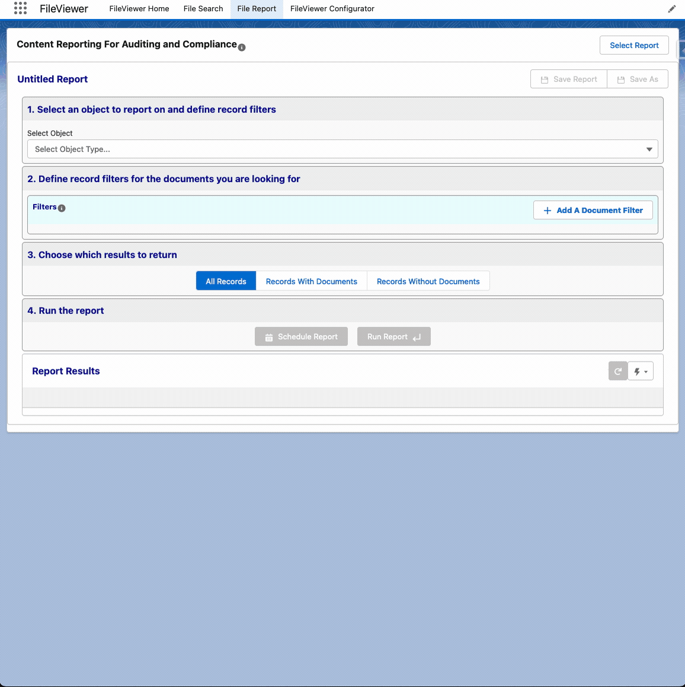
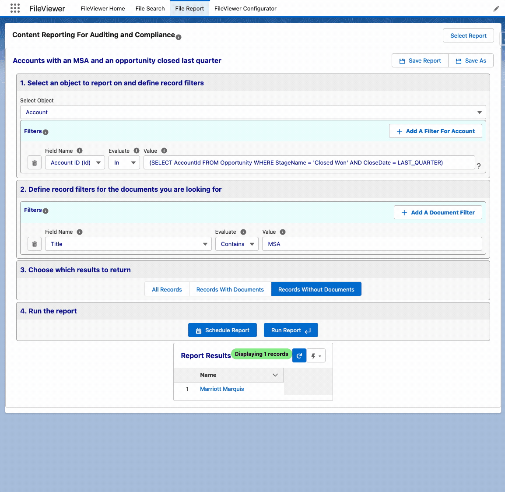

[Documentation](index.md)

# Features

1. [Upload and Tag](#upload-and-tag)
2. [Search and Filter](#search-and-filter)
3. [View on Record](#view-on-record)
4. [Resizable Preview](#resizable-previews)
5. [Bulk Upload](#bulk-upload)
6. [Tag and Update Existing Documents Quickly](#tag-and-update-existing-documents-quickly-and-easily)
7. [Tabbed Viewer](#tabbed-viewer)
8. [Powerful File Reporting](#file-reporting)
9. [File Auditing and Compliance](#file-auditing-and-compliance)
10. [Record Reports](#record-reports)

## Upload And Tag

Easily Tag Files As They are Uploaded

## Search and Filter

Driven by your organizations's values

## View on Record

View image, pdf and doc files directly on the record without navigating away

## Resizable Previews

Resize the viewing pane directly on the layout to read the fine print.

## Bulk Upload

Upload hundreds if not thousands of files at once

## Tag and Update Existing Documents Quickly and Easily

Quickly and easily work with your existing files and documents to give them the metadata they need to report, find, sort, and work with them going forward. With support to use the last edited value to quickly update files.

## Tabbed Viewer

Load viewable file content directly on the screen so users do not have to navigate away from the record they are on.

## File Reporting

Report on files and their field values - something not currently available in Salesforce

This example looks for all Accounts where an opportunity has been set to Closed Won within the last fiscal quarter, that also have a file title with 'MSA' in it (we recommend using picklists in practice). The power here is that not only can you find Accounts in Compliance with your legal standards - you can quickly find Accounts that are OUT of compliance as well by switching to Records without documents.

## File Auditing and Compliance

Reports can be built to your exacting requirements and scheduled to run on your schedule. Scheduled reports produce Salesforce Platform Events that can be used to drive the behavior and activities required to keep your company in compliance.

## Record Reports

Save a report and drop a component on a layout to help alert your users if documentation is missing.

