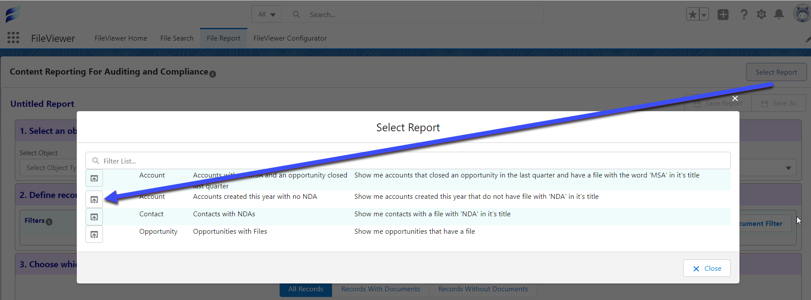
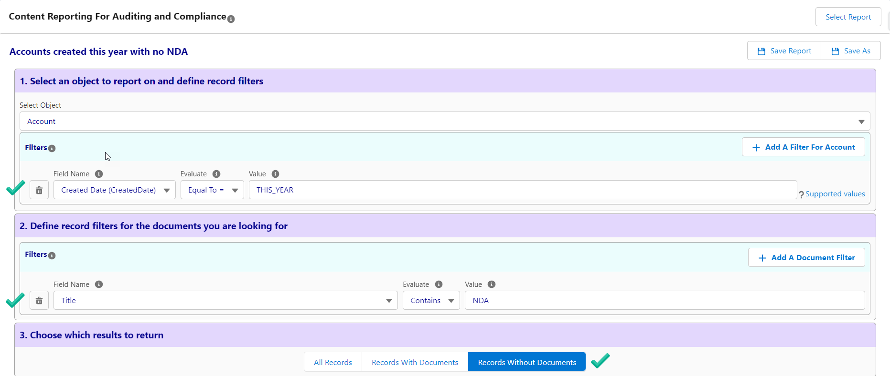
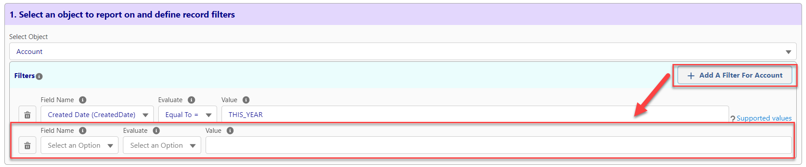
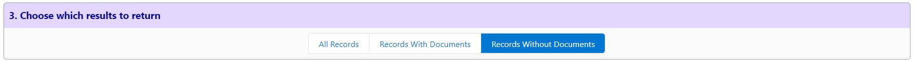

[Documentation](index.md)

# File Reporting

## Configuration and Setup

All System Administrator based profiles can see the File Report tab after installation. To allow other users to see the tab you will need to assign them the **FileViewer Reporting** permission set. To assign a permission set please follow the documentation from Salesforce (https://help.salesforce.com/s/articleView?id=sf.perm_sets_assigning.htm).

## Using Select Reports

Start off by clicking the Select Reports button to see some out of box reports based on standard Sales Cloud objects (Accounts, Contacts, and Opportunities). 

Once the Reports UI is open click the load icon to the left of a report to fill in the criteria in the sections below.

Clicking Run Report will return results from your org based on the filters established by the Quick Report selected.

From here you can save reports, add/remove filters, change the record to return criteria, and interact with result records.

### Saving Reports
There are two buttons on the top right of the Reports section will save the current filters. This will start a save event that will commit the report to the database and make it available in the Quick Reports menu.

1. Save Report - This will save the report under the existing name. If it  is a new report it will ask you to input a name and a report description.

1. Save As - This will open the UI to save a new report regardless if the report exists or not. 

### Adding or Removing Filters

To add a filter to the Selected Object in Step 1, click on the Add a Filter For <Selected Object Label> button on the top right. Once the filter row has been added selected the field from the Field Name selection, choose an Evaluation criteria, and set a value. For more help on supported values click the question mark at the end of the row.

You can also change the Selected Object by using the Selected Object drop down. This will remove all of the current filters, so make sure to save your changes before modifying the Selected Object.

To remove a filter click the trashcan next to the filter row you wish to remove. 

Follow the same steps above to add or remove a filter from the tagged documents section in Step 2.

### Record Return Criteria

The buttons in Step 3 will allow you to change the returned record set. 

- **All Records** - This will return all records that fulfill the selected object criteria in Step 1.
- **Records With Documents** - This will return all records that fulfill the selected object criteria in Step 1 and have documents that meet the criteria in Step 2.
- **Records Without Documents** - This will return all records that fulfill the selected object criteria in Step 1 and do not have documents that meet the criteria in Step 2. 

### Results Buttons

- **Schedule Report** - This will allow you to schedule a report to drive business process based ont he returned results. for more see the [Scheduling Reports](#scheduling-reports) section below 
- **Run Report** -  This button will run the report. When clicked it will go retrieve the data set again and capture any new records that should be returned based on the criteria.
- **Download** - This button will download an Excel sheet with metadata on the Content Version records returned in the Results section.
- **Download Files** - This button will download a zip file containing all the documents returned in the Results section.
- **View Details** - This button will open a new window to that rows Selected Objects Salesforce Record.

## Scheduling Reports 
Scheduling reports will allow a report to be run regularly and post platform event/ To learn more about which Salesforce technology can subscribe to platform events please see the following Salesforce Article, https://developer.salesforce.com/docs/atlas.en-us.platform_events.meta/platform_events/platform_events_subscribe.htm.

To start click the Schedule Reports button to access the scheduling UI. This UI will open the scheduling UI for the current report but will also allow you to set Schedules for all the save reports in the org.

- Frequency: There are two options for Frequency, Monthly and Weekly. 
- Days: This is a multi-select list aht lets you pick one or more days for the schedule to run on.
- Start At: This is the time the schedule should run at the frequency and days your chose previously.

At this point you can click Create Schedule to generate a scheduled job for the report with the setting you choose.

- Advanced: clikc advanced 

## Using Flows to Automate Action From on Scheduled Reports.

## Creating Custom Reports

Instead of using Quick Reports, a custom report can be created to store reports for specific business needs. To create a new report choose an object from the Select Object section in Step 1. Next add filters to that object and the docmuents you want to see in Step 2 and Step 3, respectively. Then choose which results you want to return in Step 4 and click Run Report.

You can save this report for future use using the same steps in the [Saving Reports](#saving-reports) above.

___

[FileViewer FAQ](https://getfirmworks.com/#faq)

For FileViewer Support, please contact <support@getfirmworks.com>
