# firmworks FileViewer

File Viewer is a native salesforce application designed to make the storing, retrieving and editing of Content faster and easier.

- [Features](#features)
- [Post Install Config](#post-install-config)
   - [Creating New Tags](#creating-new-tags)
   - [Changing Displayed Tag Fields in the Components](#changing-displayed-tag-fields-in-the-components)
   - [Creating FileViewer Quick Action](#creating-fileviewer-quick-action)
- [Additional Optional Setup](#additional-optional-setup)
   - [Assigning the Default Tab to Apps](#assigning-the-default-tab-to-apps)
   - [Creating a new File Viewer Tab](#creating-a-new-file-viewer-tab)
   - [Configuring a Record Page Layout](#configuring-a-record-page-layout)
      - [File Tag Launcher](#file-tag-launcher)
      - [File Tagger](#file-tagger)
      - [File Viewer](#file-viewer)
   - [Setting up a File Viewer Configuration Metadata Record](#setting-up-a-file-viewer-configuration-metadata-record)
   - [Configuration for Experience Page](#configuration-for-experience-page)
- [Component Appendix ](#component-appendix)
   - [File Viewer Appendix](#file-viewer-appendix)
   - [File Tag Launcher Appendix](#file-tag-launcher-appendix)
- [Visit Us](#visit-us)
- [Release Notes](release-notes.md)

## **Features**

Easily Tag Files As They are Uploaded

Search driven by your companies values

<!--Embedded Related File Viewer

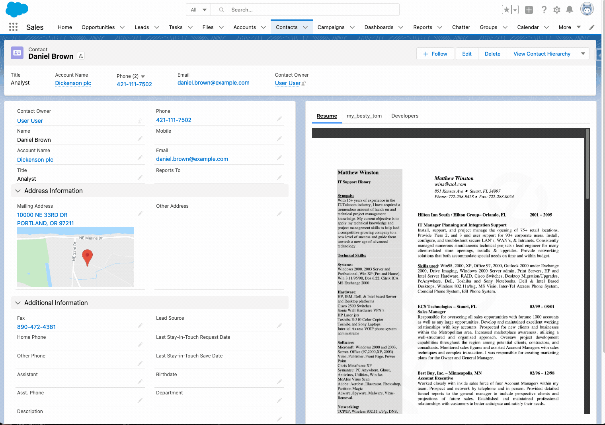 -->

## **Post Install Config**

1. Add the 'Tag and Upload' Global Action to the Global layout or to the layout of any Object

    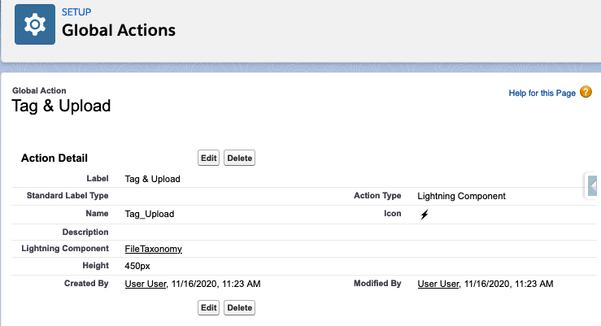

1. Add the Lightning Component "File Viewer" to any lightning Record Page Layout to get a contextual view of related content.

    

1. Curate Viewer fields by adding custom fields onto the ContentVersion Object to control tagging and searchable. Add picklists, multi-select picklists, lookup fields, and others to help define the shape of the documents.
    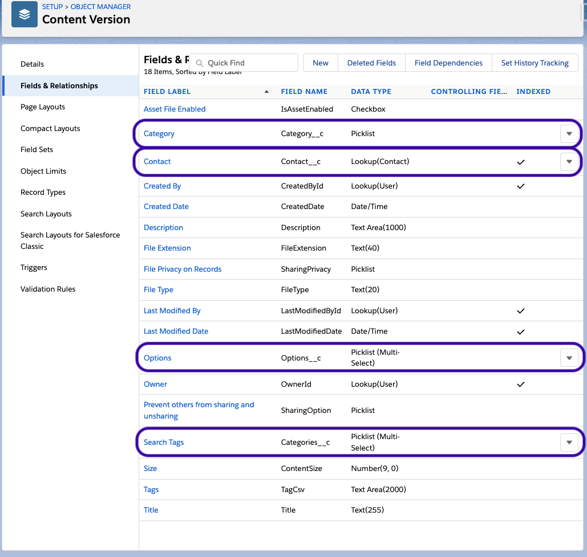

1. Give users permissions to the Viewer fields and the permission set for 'FileViewer'.

1. Discover and work with files through the File Viewer tab.

1. Add taxonomy launcher to any layout to get users to tag files as they upload them.
    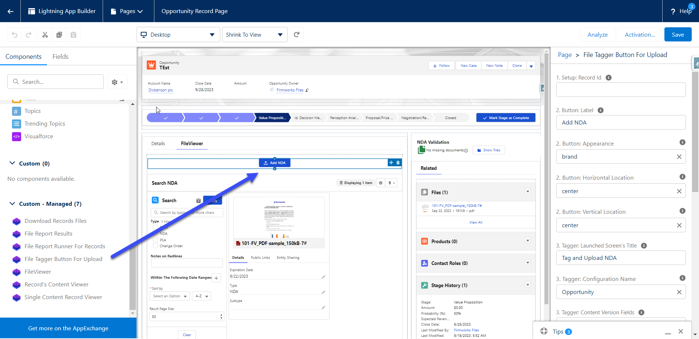

### **Creating New Tags**

The FileViewer App will automatically include any custom field on the Content Version for tagging and will add it to the Tag and Upload UI where it is used.

To create a new custom field see the documentation from Salesforce [https://help.salesforce.com/s/articleView?id=sf.adding_fields.htm](https://help.salesforce.com/s/articleView?id=sf.adding_fields.htm)

### **Changing Displayed Tag Fields in the Components**

You can adjust the default fields shown in the FileViewer Package component by setting the Configuration: Filter Fields in the design for the File Tag Launcher and File Tagger Component.

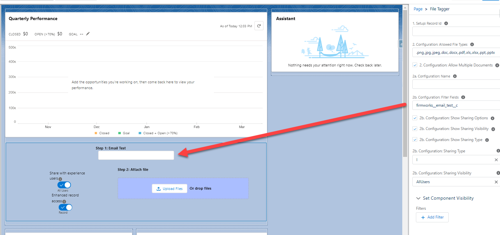

In the File Viewer Component there are two design elements. Display Fields change the field visible in the table view of documents and Filter Fields changes the visible fields in the search bar on the left.

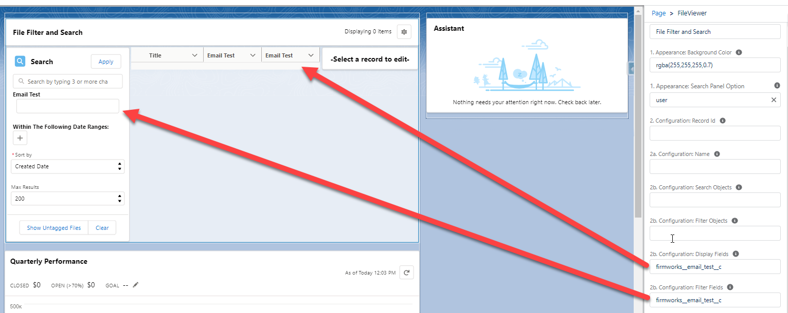

### **Creating FileViewer Quick Action**

1. If you do not want to use the Global Action Provided out of box by Firmworks you can create a File Viewer Quick Action, by going to the Salesforce Setup -> Object Manager -> The object where you want the quick action. Then click New Action
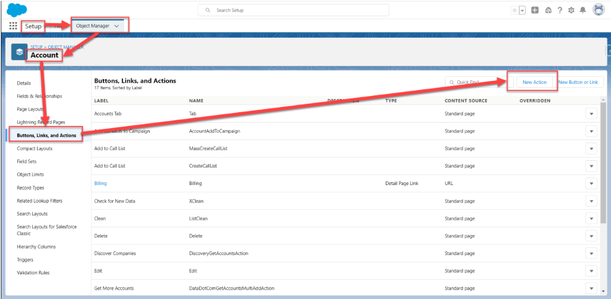

1. Once in the New Action Creation UI set the Action Type for Lightning Component and the Lightning Component to firmworks:filetaxonomy. You can set the other variables to any values you desire.
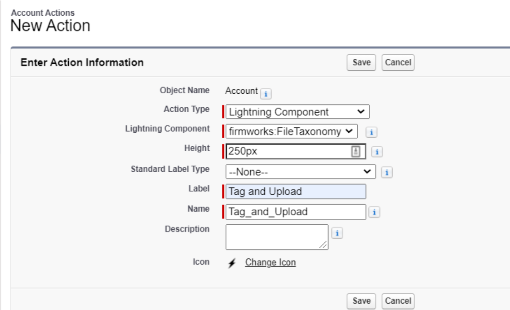

1. Once you save the action add it to the page layout using the Page Layouts section of the Object Manager.

### **Modifying Display Fields in FileViewer Quick Action**

In order to modify display fields on the Quick Action you must create a configuration with the field you want to see. The configuration name needs to match the object API name as it is in Salesforce. EX. Account is Account, Custom Object A is Custom_Object_A__c. See [Setting up a File Viewer Configuration Metadata Record](#setting-up-a-file-viewer-configuration-metadata-record) for more information on setting up a configuration.

Here is an example record build on the Account with custom tags added:
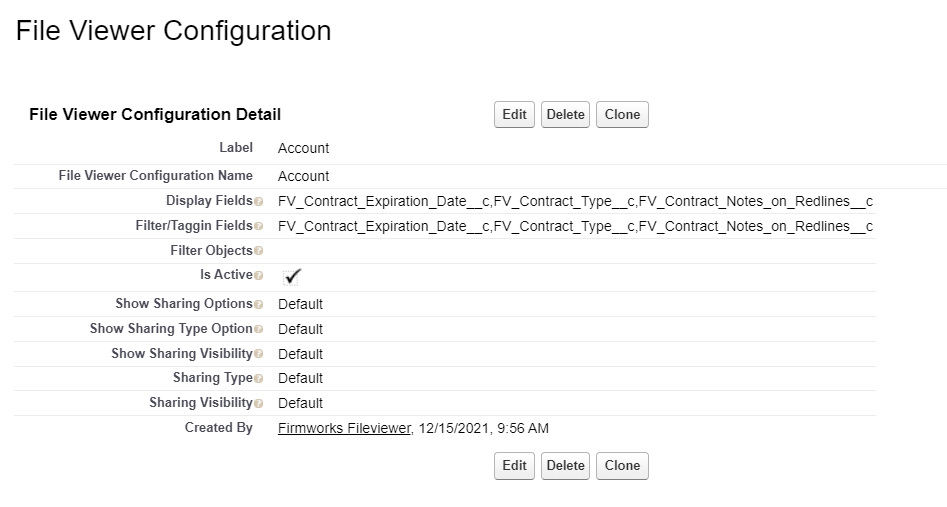

## **Additional Optional Setup**

### **Assigning the Default Tab to Apps**

1. To add the default File view tab to other Salesforce apps, navigate to Salesforce Setup -> App Manager -> click edit on the app you want to add the tab to.

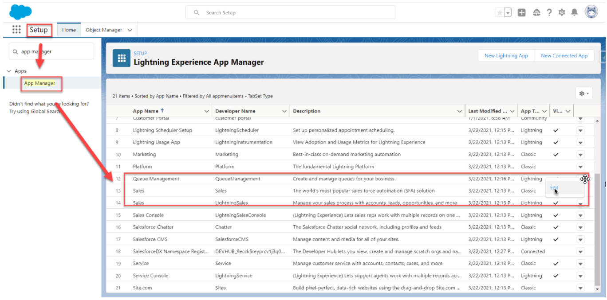

1. Once in the App Settings click on Navigation Items and find the File Viewer tab on the left and move it to the right then click save.

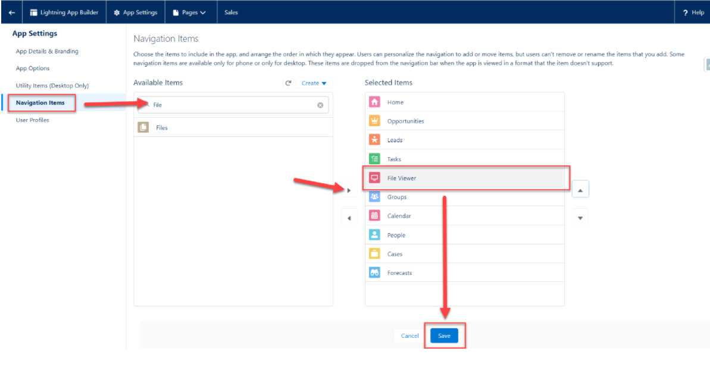

### **Creating a new File Viewer Tab**

1. To Create a new File Viewer tab, go to Salesforce Setup -> Tabs -> Lighting Component Tabs. Then Choose one of the two file viewer components that you want to see in the tab, then click next to assign profiles and apps to the new tab.

   firmworks:fileviewer is the Component you see in the Default File Viewer Tab

   firmworks:filetaxonomylauncher is a UI for tagging and uploading new documents. For more please see the Component Overview section of this document.

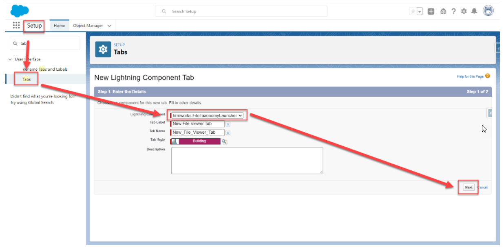

 1. Once you save the action add it to the page layout using the Page Layouts section of the Object Manager.

### **Configuring a Record Page Layout**

You can add any of the following components to a page layout

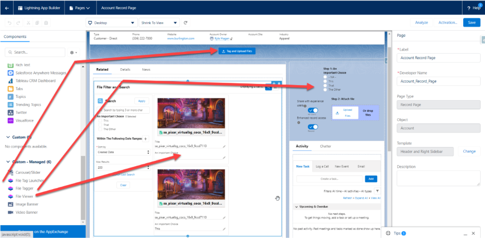

Each Component has a series of Design Options you can use to customize each Component. To see the design layout use the [Component Appendix](#Component Appendix).

#### **File Tag Launcher**

1. Setup:

   1. Record Id - This section will allow you to pass in a record into give the component context do the record page it is on.

1. Button:

   1. Label – The label for the Button

   1. Appearance – This allows you to define the style of the button using SLDS Button Design types.

   1. Horizontal Location - The location of the button across the page

   1. Vertical Location - The location of the button in the from top to bottom

1. Tagger:

   1. Launched Screens Title - The title of the UI component once the button is clicked

   1. Configuration Name – The name of the File Viewer Configurations Metadata record you want to use to source your tag launcher screen

   1. Filter Fields - A comma delimited list of Content Version fields you want to filter by.

   1. Allowed File Types – a comma delimited list of file types the user is allowed to upload.

   1. Allow Multiple Documents - This box will allow the user to upload multiple documents with oud having to close and reopen the UI.

   1. Tagger Sharing:

      1. Show Sharing Options - Toggle this to show or hide all sharing options.

      1. Show Sharing Visibility – Toggle this to show and hide Share with experience Users Toggle

      1. Show Sharing Type – Toggle this show and hide the Enhanced record access toggle.

      1. Sharing Type – This will default the Sharing type regardless of if Show Sharing type is true.

         1. If set to I the toggle will default to Record.

         1. If set to V the toggle will default to Viewer.

      1. Sharing Visibility – This will allow you to default the Sharing Options regardless of if Show Sharing Options is true

         1. AllUsers – Defaults the toggle to All Users

         1. InternalUsers – Defaults the toggle to Default

#### **File Tagger**

1. Setup:

   1. Record Id - This section will allow you to pass in a record id to give the component context do the record page it is on.

1. Configuration:

   1. Allowed File Types – a comma delimited list of file types the user is allowed to upload.

   1. Configuration Name – The name of the File Viewer Configurations Metadata record you want to use to source your tagger screen

   1. Allow Multiple Documents - This box will allow the user to upload multiple documents with oud having to close and reopen the UI.

   1. Filter Fields - A comma delimited list of Content Version fields you want to use to tag the File.

   1. Show Sharing Options - Toggle this to show or hide all sharing options.

   1. Show Sharing Visibility – Toggle this to show and hide Share with experience users toggle

   1. Show Sharing Type – Toggle this show and hide the Enhanced record access toggle.

   1. Sharing Type – This will default the Sharing type regardless of Show Sharing type being true.

      1. 1. I - Defaults the toggle to Record.

      1. V - Defaults the toggle to Viewer.

   1. Sharing Visibility – This will allow you to default the Sharing Options regardless of Show Sharing Options being true.

      1. AllUsers – Defaults the toggle to All Users

      1. InternalUsers – Defaults the toggle to Default

#### **File Viewer**

1. Appearance:

   1. Title – The title for the component

   1. Background Color – The rgba color designation for the background color of the component

   1. Search Panel Option – Defining default behaviors for Show/Hiding the Search Panel

      1. User – Tracks the last state of the panel based on the user’s preference

      1. Hidden – Removes the ability to search

      1. On - Toggles search panel on by default

      1. Off – Toggles search panel off by default

1. Configuration:

   1. Record Id – Use this to give context to the component so it only shows records related to the provided record Id.

   1. Name - The name of the File Viewer Configurations Metadata record you want to use to source your viewer screen

   1. Search Objects – Comma delimited list of objects the user can search against

   1. Filter Objects - Comma delimited list of objects the user can filter against

   1. Display Fields - Comma delimited list of content version fields to display

   1. Filter Fields - Comma delimited list of content version fields to filter against

1. Behavior:

   1. Cache Id – If you want the behavior to be different between instances of the file's viewer. Use this variable to a unique variable or name to reference the way you have the component set up in each place. If you have the component set up on the account a very specific, you want to use for every object, use the cache id to not have to setup all the settings again.

### **Setting up a File Viewer Configuration Metadata Record**
If you want to use the same configuration for more than one use of the component you can create a File Viewer Configuration Metadata record. The Metadata fields are a subset of fields you see in the components design.

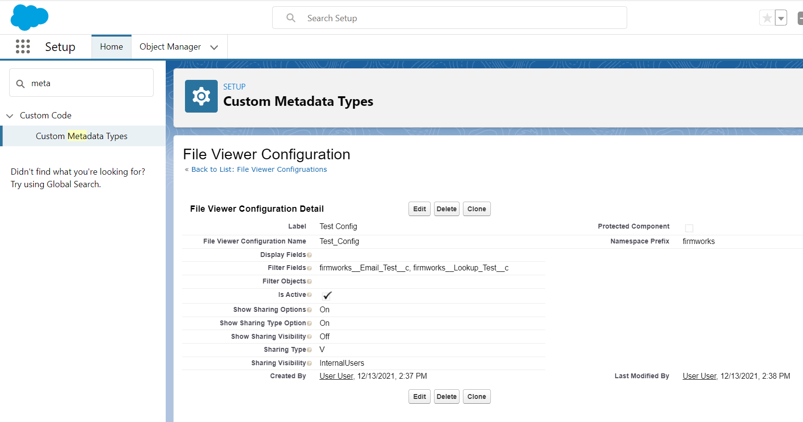

See more on metadata in Trailhead from Salesforce [Metadata Trailhead](https://trailhead.salesforce.com/en/content/learn/projects/add-sound-effects-to-your-sf-org/create-a-custom-metadata-record-sound)

Once created reference the File Viewer Configuration Name in the components Configuration Name design element.

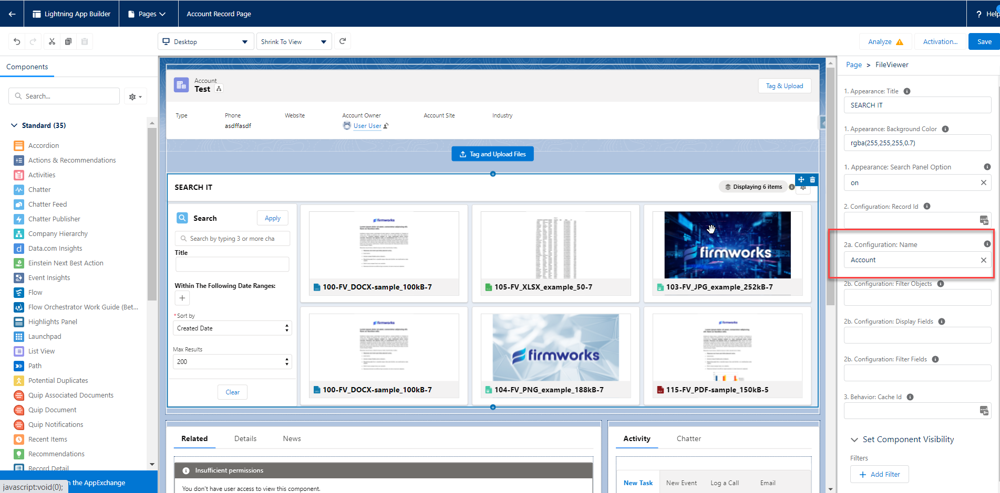

### **Configuration for Experience Page**

This section will require an active Experience to setup. See more documentation on setting up an Experience from Salesforce [https://help.salesforce.com/s/articleView?id=sf.networks_setup_maintain_communities.htm](https://help.salesforce.com/s/articleView?id=sf.networks_setup_maintain_communities.htm&type=5).

Open the Experience Builder from Salesforce Setup, navigate to the Experience page you want to add the component, open the Components menu on the right, then navigate to the Custom Components Section. From here you can drag either the File View or File Tag Launcher Component onto the Experience page.

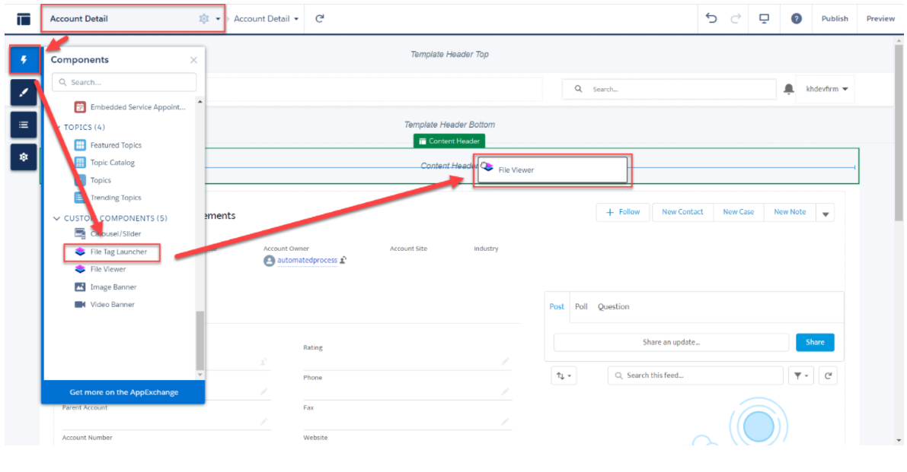

From here you can follow the [Configuring a Record Page Layout](#configuring-a-record-page-layout) section above to configure the components.

You will need to share the following apex classes with your Experience user profile in order for the users to upload files:

- firmworks.FileTaxonomyController

- firmworks.ObjectFinderController

## **Component Appendix**

#### **File Viewer Appendix**

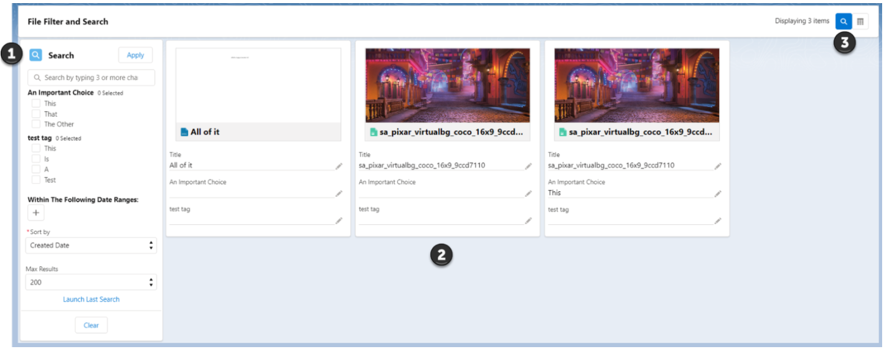

1. Search Section: The topmost bar will allow you to search any of the object allowed to be search from the setup of the component. If Search Objects was left blank it will search all objects. The Apply button will apply any search elements defined in the search section.

   1. Each tag is shown in the search section filter documents. Check the boxes for the tags you want to filter on the click Apply.

   1. Clicking the + button below the ‘Within The Following Date Ranges:’ section will result in a date filter section being added.
   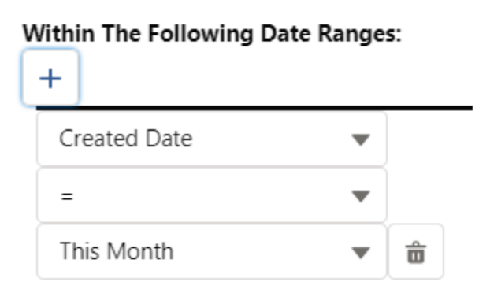

   1. This allows you to use the date fields on the Content Version to filter. If you choose Custom range, you will be given a date picker UI to choose the dates.

      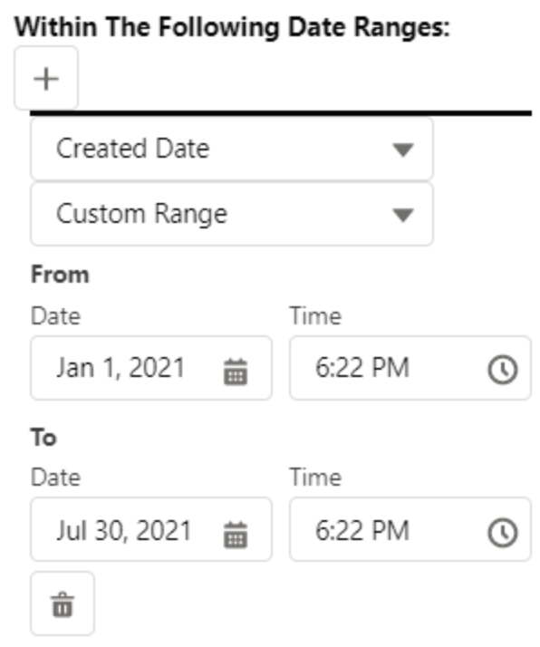

      This can be added multiple times. Once you add dates to filter on click the Apply button.

   1. Sort By will allow you to sort the searched files by the chosen field

   1. Max results limits the number of results per page by the chosen number

1. Results Section: This is the files returned by your search results. Each tile is set up the same way. Clicking one of the edit panels will allow the user to edit the file.

   1. Preview of the Document

   1. Title of the document

   1. All tags on the Content Document object

1. This section will allow you to toggle various aspects of the File Viewer page

   1. This displays the number of records returned form the search.

   1. Clicking the magnifying will toggle the search section from visible (blue) to not visible (white)

   1. Clicking the stacked bars will toggle the results section from list view (blue) to tile view (white)

#### **File Tag Launcher Appendix**

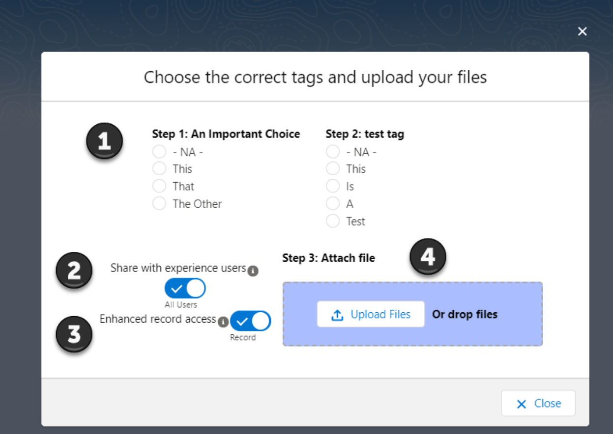

When using this UI please make sure you follow the steps in order (1 -> 2 -> 3) to make sure tagging and sharing works correctly with each file.

1. This Section Shows you the Tags they can be associated with the files uploaded. Make sure to set your tags before you upload the file. Tags can be left the same between upload or changed. If you use the Upload Files button the set tags will be associated with all files uploaded.

1. This section allows for the user to decide if the uploaded files should be shared with all users (All Users) or only internal users (Default). This works on a per file bases if drag drop is used or with multiple files if using the Upload Files button.

1. This Section allows for the user to decide if they want to have the files shared with inferred sharing from the related records (Record) or only if the file should be view only to people with record access (viewer). This works on a per file bases if drag drop is used or with multiple files if using the Upload Files button.

1. This is the section where you literally upload the files. You can drag drop one file at a time or click the upload files button to upload multiple files.

# **Visit Us**

https://getfirmworks.com

support@getfirmworks.com
