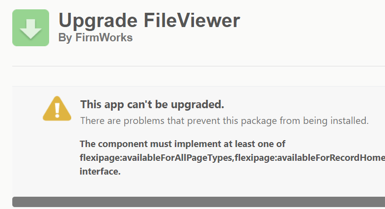
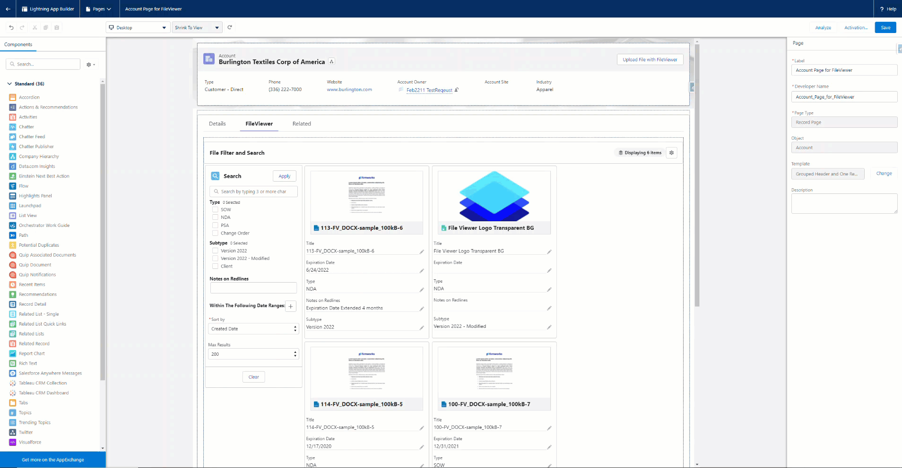

[Documentation](index.md)

# Knows Issue

## 0.11 - February 2022

#### File Tagger Component Changes

- Moving forward the File Tagger is no longer able to be used in page layouts. If you experience the above error installing the new package you will need to do the following.

   - Remove any uses of the File Tag Launcher component from page layouts and Experiences. Republish any Experiences you removed uses from. 
   - Remove any uses of the File Tagger component from page layouts. They will need to recreated later as File Tag launcher buttons so keep track of your Design Settings, 
   - Remove from page layouts and delete any Custom Actions that reference the FileTaxonomy component.

- Once you install the new package you will need to recreate what you removed so please make sure to keep track of all of the use cases.

#### Configuration Name Design Bug

- If you edit a page where you are currently using a File Viewer Component (File Tag Launcher or File Viewer) you will get the following error:

-  To fix it just set the Configuration Name design element in the component.

