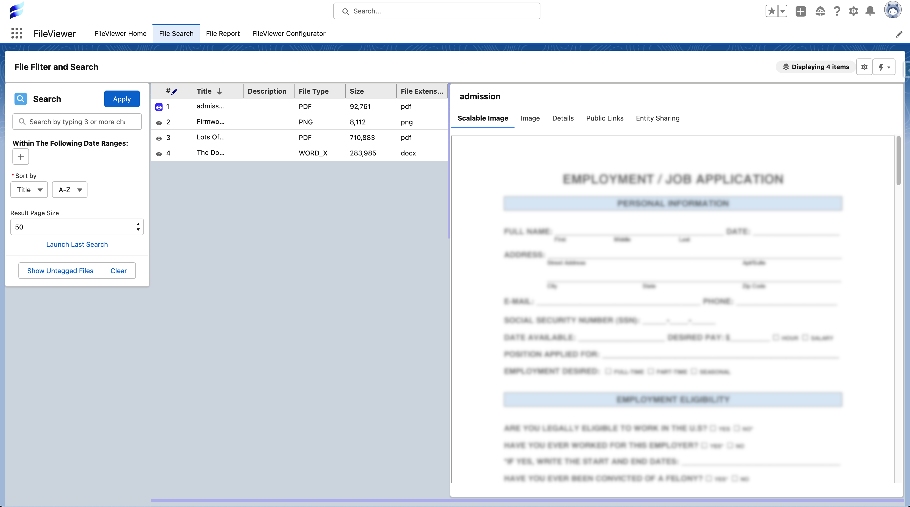
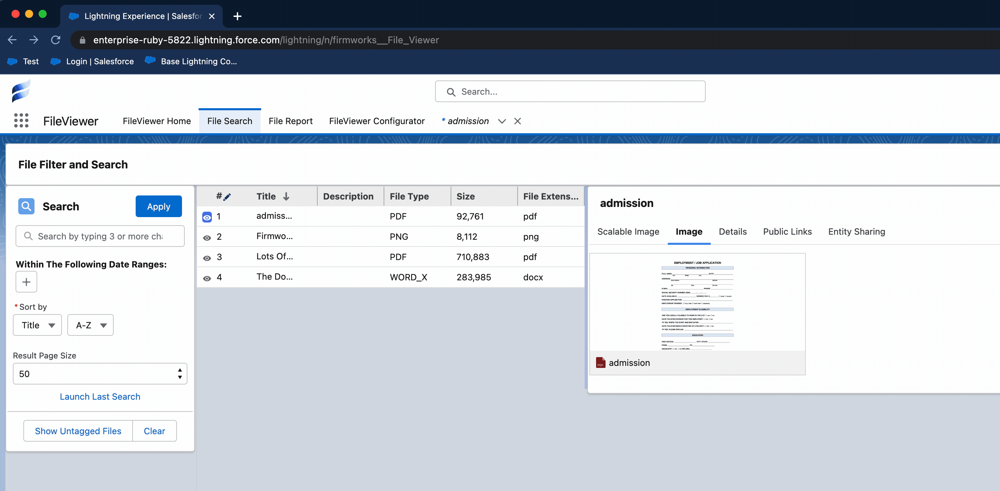
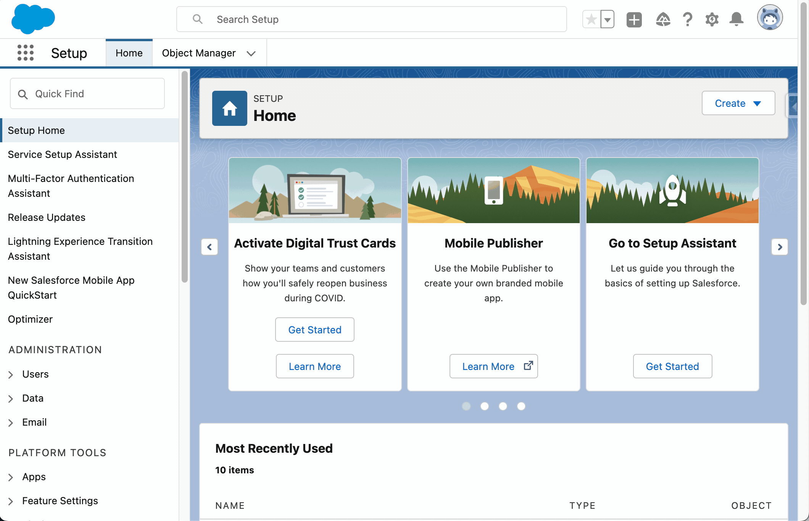
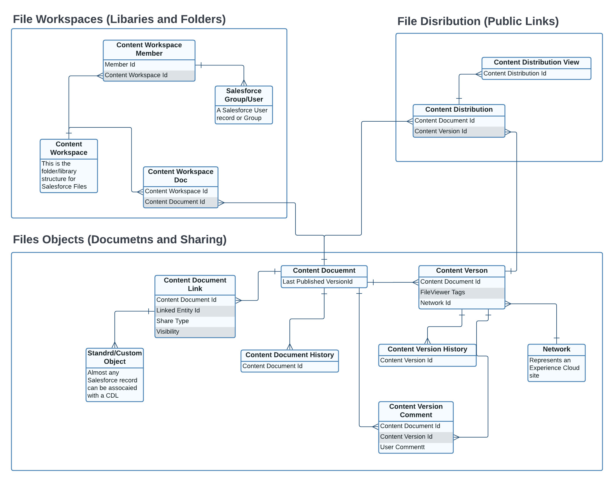

# Tips And Known Issues

## Salesforce Images Low Quality Render

### Occasionally Salesforce will render poor quality images of a document (for instance a pdf)

Luckily Salesforce provides a way to regenerate images.

1. First we need to get the Content Document Id of the File
    - This can be done in a number of ways - the easiest is to use Salesforce's file image to open the modal window, navigate to view document and get the id from the url.
    - 
2. Give the content id to an administrator or a someone with access to setup.
3. From within the setup section
    1. Go to regenerate previews
    2. Enter the id and click 'Regenerate Preview'
    3. Wait a few minutes for the image to regenerate.

### Using The Alternate Viewer

If using Google's Chrome browser window and you have permissions (check with your internal security officer first) you can use an extension such as:

***IMPORTANT! Firmworks does not support or endorse any browser extensions. The following extension does not publish security or privacy information and there for by installing it you are using it at your own risk!***

- [PDF-Viewer](https://chrome.google.com/webstore/detail/pdf-viewer/oemmndcbldboiebfnladdacbdfmadadm/related?hl=en-US) to open pdf's in screen with FileViewer's Alternate Viewer button.

### File Sharing and Access Explained

Access to a Salesforce Files is determine by two different aspects of the associated Content Document Links:

- **ShareType** - The determined is how the user can see the files. The option selected will determine if the file is visible to the user.
    - **V (Viewer in FileViewer)** - Viewer Permission: the user can only view the file but not update tags or edit the
    - **I (Record in FileViewer)** - Inferred Permission: The user can interact with the file based on how they can interact with the record associated in teh Content Document Link. If they have read permission to the object that is linked to the document they can view the file but not edit it. If they have read/write permission to the object, they can view and edit tags on the document.

- **Visibility** - This determines if the document is visible to internal users or internal and external users based on the option selected. There are exceptions to visible that can be found on the [Salesforce Documentation](https://developer.salesforce.com/docs/atlas.en-us.object_reference.meta/object_reference/sforce_api_objects_contentdocumentlink.htm). 
    - AllUsers - The file is available to everyone with access  based on the ShareType
    - InternalUsers - The file is available to only infernal user who have access based on the ShareType.

### Salesforce Files Object Structure

Below is an Entity Relationship Diagram (ERD) of the Salesforce Files Schema. This is not all of them but it contains the majority of the relvant object for FileViewer use.

