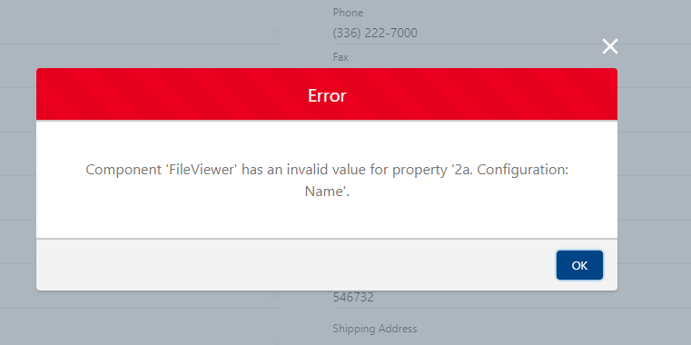

[Documentation](index.md)

# FileViewer Release Notes

## 0.13 - June 2022

### What's New

- Content Viewer Control - Preview pdfs, documents, videos and audio directly in lightning layouts.
- Content Viewer List - Quickly enable your users by dropping this control on a record layout to visually tab through all of the files related to a record.
- File Report Result - Define a File Viewer Report to run and drop this result set anywhere to drive activities.
- File Record Report - Define a File Viewer Report and drop this component on a record to visually tell your users whether the record is in compliance or not with the attached records.
- Schedule Reports to run which generate File Viewer Report platform events to drive the behaviors required of your organization. Create Tasks, Chatter User and more!
- New Persona Support - data entry, configure your content versions to enable users to work through a queue of documents, tagging and building usable libraries quickly and easily within one screen.

### Enhanced File Previews Using Content Viewer Components

- Integrate your files directly into your work flow, no more navigating away to view file contents.
- View documents directly on record layouts
- View supported audio and video files directly within the lightning page.
- Enhanced File Previews directly integrated into the FileViewer search screen to allow for enhanced data entry, minimizing mistakes as users have direct context to the document being viewed.

### Data Entry from Files made Easy

- File Viewer list view user interface updated to support heave data entry from Salesforce files for auditing file content.
- Auto-complete data in rows to more easily enter large amounts of data when using the File Viewer list.
- Pagination added to lists to allow for easy navigation over hundreds of files while maintaining changes on previous pages.

### Reporting

- Enhanced experience of working with, editing and saving reports.
- New Reporting control - Configure a report for your users and deploy it into lightning pages
- New Reporting control - Configure a report and drop a record report on a layout to let your users know if the record has the appropriate documents related or not.
- Schedule reports to run regularly that publish platform events allowing your implementors to create tasks, objects, drive activities and flows to close the gap in your document lifecycle.

### Enhancements

#### File Search

- List view is now editable to assist users in data entry directly in the file search.
- List View supports side by side content viewing to facilitate easier data entry from a document into Salesforce.

#### Reports

- Reports can be scheduled to run to produce platform event to drive business process
- hook into reports using a automation to provide you users insight into data that is out of compliance.

### Bug Fixes

- You will no longer see the follow error when editing a page with a File Viewer Component:

--------------------------------------------------
## 0.11 - February 2022

### New Features

#### File Reporting

- Advanced cross-object reporting for Salesforce Files.
- Quick reports included to get started with cross object reporting.
- Save impactful reports to easily reuse later.
- Download reports to act on your files.

### Enhancements

#### File Tagging

- Supports Dependent Picklists and Record Types (excludes Record Type filtered picklists).
- Improved user experience with dependent picklists when tags no longer apply.
- Tag error visibility and the ability to re-tag files.
- Provides the ability to set default tag values per object, lightning page, or more.
- Lookup field tags with less than 20 records will display as a radio button list as opposed to a search interface.

#### File Search

- See your newest files first with default descending sort order for files based on Created Date.
- New interface where end users can customize fields that show on tiles and in list view.
- Supports the usage of Content Version Formula fields in filtering and file views.
- New mobile interface using a stacked view for on-the-go users.

#### Configuration Interface

- New FileViewer Configurator provides a builder-like, friendly user interface:
    - Set display fields, filter fields, and filter on specific objects for all components.
    - Establish default values for tags using the field value section.
    - Maintain unified security and visibility settings over multiple components.