[Installation and Setup 2](#installation-and-setup)

[Additional Optional Setup 2](#additional-optional-setup)

[Assigning the Default Tab to Apps
2](#assigning-the-default-tab-to-apps)

[Creating a new File Viewer Tab 4](#creating-a-new-file-viewer-tab)

[Creating FileViewer Quick Action
5](#creating-a-file-viewer-lightning-tab)

[Configurating a record page layout
7](#configurating-a-record-page-layout)

[File Viewer 9](#file-viewer)

[Advanced Configurations 10](#advanced-configurations)

[Setting Up Tags for the Tag and Upload UI
10](#setting-up-tags-for-the-tag-and-upload-ui)

[Setting up a File Viewer Configuration Metadata Record
10](#setting-up-a-file-viewer-configuration-metadata-record)

[Configuration for Community Page 11](#configuration-for-community-page)

[Component Overview 12](#component-overview)

[FileViewer 12](#fileviewer)

[FileTaxonomyLauncher 14](#_Toc78542078)

# Installation and Setup

To install FlipViewer please use the follow links for the various
environments:

[Production/Developer
Accounts:](https://login.salesforce.com/packaging/installPackage.apexp?p0=04t5Y0000027FR3QAM)

[Sandbox/Scratch
Orgs](https://test.salesforce.com/packaging/installPackage.apexp?p0=04t5Y0000027FR3QAM)


After instillation is complete you will need to do the Follow to allow
user to be able to use FileViewer:

-   Assign any users who need access the FileViewer Permission set
    named: File Viewer

# Additional Optional Setup

## Assigning the Default Tab to Apps

To add the default File view tab to other Salesforce apps, navigate to
Salesforce Setup -\> App Manager -\> click edit on the app you want to
add the tab to.

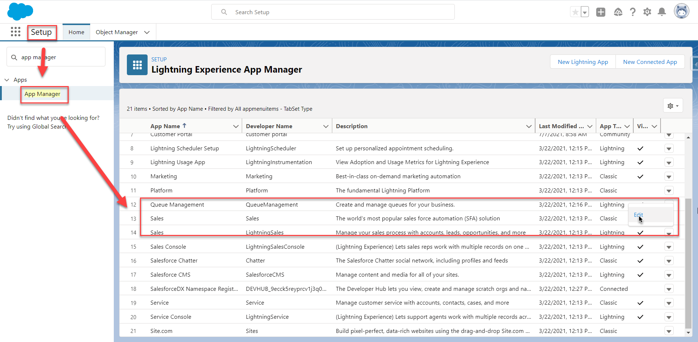Once in the App Settings click on
Navigation Items and find the File Viewer tab on the left and move it to
the right then click save.

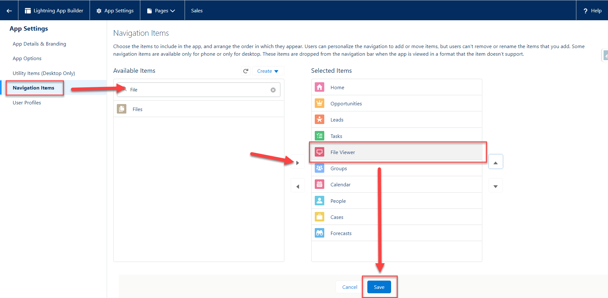

## Creating a new File Viewer Tab

To Create a new File Viewer tab, go to Salesforce Setup -\> Tabs -\>
Lighting Component Tabs. Then Choose one of the two file viewer
components that you want to see in the tab, then click next to assign
profiles and apps to the new tab.\
\
firrmworks:fileviewer is the Component you see in the Default File
Viewer Tab

firrmworks:filetaxonomylauncher is a UI for tagging and uploading new
documents. For more please see the Component Overview section of this
document.

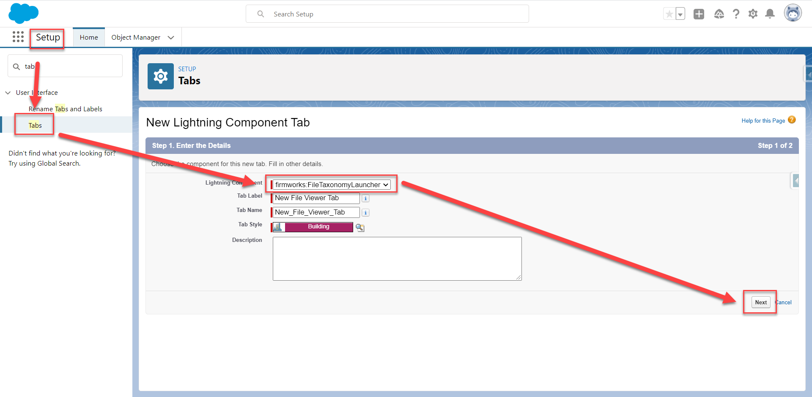


## Creating FileViewer Quick Action

If you do not want to use the Global Action Provided out of box by
Firmworks you can create a File Viewer Quick Action, go to the
Salesforce Setup -\> Object Manager -\> The object where you want the
quick action. Then click New Action

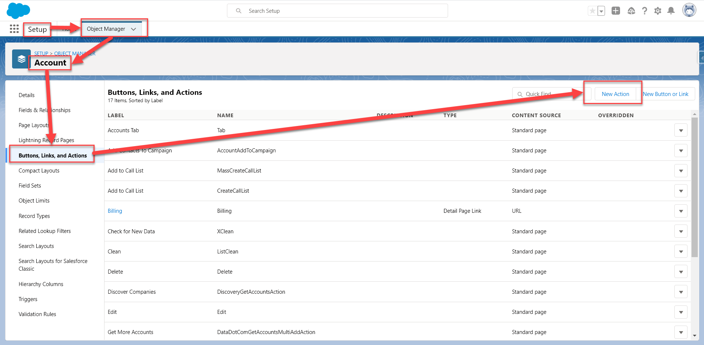Once in the New Action Creation UI set the
Action Type for Lightning Component and the Lightning Component to
firrmworks:filetaxonomy. You can set the other variables to any values
you desire.\
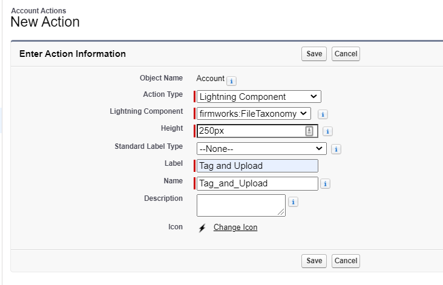

Once you save the action add it to the page layout using the Page
Layouts section of the Object Manager.

## Configurating a record page layout

You can add any of the following components to a page layout

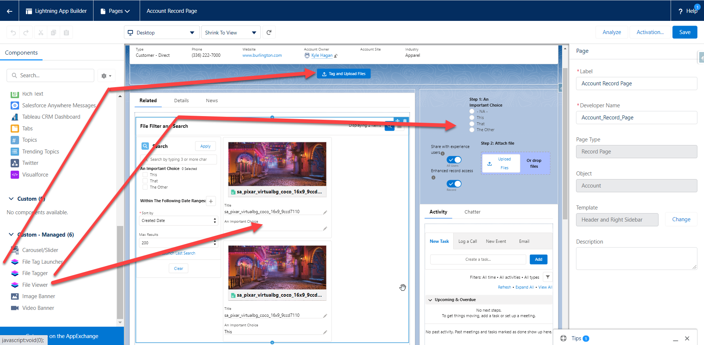

Each Component has a series of Design Options you can use to customize
each Component:

File Tag Launcher

1.  Setup:

    a.  Record Id - This section will allow you to pass in a record idto
        give the component context do the record page it is on.

2.  Button:

    a.  Label -- The label for the Button

    b.  Appearance -- This allows you to define the style of the button
        using SLDS [Button Design
        types](https://www.lightningdesignsystem.com/components/buttons/).

    c.  Horizontal Location - The location of the button across the page

    d.  Vertical Location - The location of the button in the from top
        to bottom

3.  Tagger:

    a.  Launched Screens Title - The title of the UI component once the
        button is clicked

    b.  Configuration Name -- The name of the File Viewer Configurations
        Metadata record you want to use to source your tag launcher
        screen

    c.  Filter Fields - A comma deiminated list of Content Version
        fields you want to filter by.

    d.  Allowed File Types -- a comma delimited list of file types the
        user is allowed to upload.

    e.  Allow Multiple Documents - This box will allow the user to
        upload multiple documents with oud having to close and reopen
        the UI.

    f.  Tagger Sharing:

        i.  Show Sharing Options - Toggle this to show or hide all
            sharing options.

        ii. Show Sharing Visibility -- Toggle this to show and hide
            Share with experience Users Toggle

        iii. Show Sharing Type -- Toggle this show and hide the Enhanced
             record access toggle.

        iv. Sharing Type -- This will default the Sharing type
            regardless of if Show Sharing type is true.

            1.  If set to I the toggle will default to Record.

            2.  If set to V the toggle will default to Viewer.

        v.  Sharing Visibility -- This will allow you to default the
            Sharing Options regardless of if Show Sharing Options is
            true

            1.  AllUsers -- Defaults the toggle to All Users

            2.  InternalUsers -- Defaults the toggle to Default

### File Tagger

1.  Setup:

    a.  Record Id - This section will allow you to pass in a record id
        to give the component context do the record page it is on.

2.  Configuration:

    a.  Allowed File Types -- a comma delimited list of file types the
        user is allowed to upload.

    b.  Configuration Name -- The name of the File Viewer Configurations
        Metadata record you want to use to source your tagger screen

    c.  Allow Multiple Documents - This box will allow the user to
        upload multiple documents with oud having to close and reopen
        the UI.

    d.  Filter Fields - A comma deiminated list of Content Version
        fields you want to use to tag the File.

    e.  Show Sharing Options - Toggle this to show or hide all sharing
        options.

    f.  Show Sharing Visibility -- Toggle this to show and hide Share
        with experience users toggle

    ```{=html}
    <!-- -->
    ```
    a.  Show Sharing Type -- Toggle this show and hide the Enhanced
        record access toggle.

    b.  Sharing Type -- This will default the Sharing type regardless of
        Show Sharing type being true.

        i.  I - Defaults the toggle to Record.

        ii. V - Defaults the toggle to Viewer.

    c.  Sharing Visibility -- This will allow you to default the Sharing
        Options regardless of Show Sharing Options being true

        i.  AllUsers -- Defaults the toggle to All Users

        ii. InternalUsers -- Defaults the toggle to Default

### File Viewer

1.  Appearance:

    a.  Title -- The title for the component

    b.  Background Color -- The rgba Color Designation for the
        background color of the component

    c.  Search Panel Option -- Defining default behaviors for
        Show/Hiding the Search Panel

        i.  User -- Tracks the last state of the panel based on the
            user's preference

        ii. Hidden -- Removes the ability to search

        iii. On - Toggles search panel on by default

        iv. Off -- Toggles search panel off by default

2.  Configuration:

    a.  Record Id -- Use this to give context to the component so it
        only shows records related to the provided record Id.

    b.  Name - The name of the File Viewer Configurations Metadata
        record you want to use to source your viewer screen

    c.  Search Objects -- Comma delimited list of objects the user can
        search against

    d.  Filter Objects - Comma delimited list of objects the user can
        filter against

    e.  Display Fields - Comma delimited list of content version fields
        to display

    f.  Filter Fields - Comma delimited list of content version fields
        to filter against

3.  Behavior:

    a.  Cache Id -- If you want the behavior to be different between
        instances of the file\'s viewer. Use this variable to a unique
        variable or name to reference the way you have the component set
        up in each place. If you have the component set up on the
        account a very specific, you want to use for every object, use
        the cache id to not have to setup all the settings again.

# Advanced Configurations

## Setting Up Tags for the Tag and Upload UI

The FileViewer App will automatically assume any custom field on the
Content Version should be used for tagging and will add it to the Tag
and Upload UI where it is used.

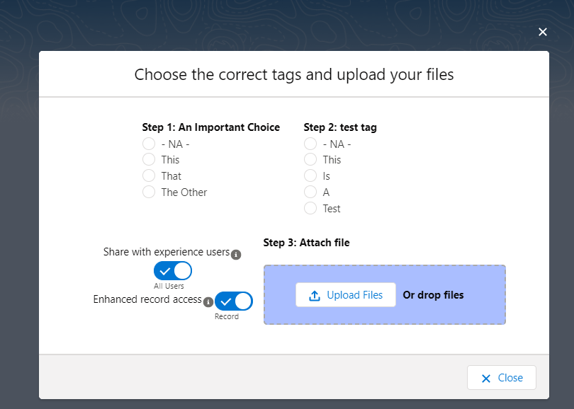

If you have custom fields, you do not desire to use for tagging or want
to change the order they display in the Tag and Upload UI \...

## Setting up a File Viewer Configuration Metadata Record

Coming Soon\...

## Configuration for Community Page

This section will require an active community to setup

Open the Community Builder from Salesforce Setup, navigate to the
Community page you want to add the component, open the Components menu
on the right, then navigate to the Custom Components Section. From here
you can drag either the File View or File Tag Launcher Component onto
the community page.\
\
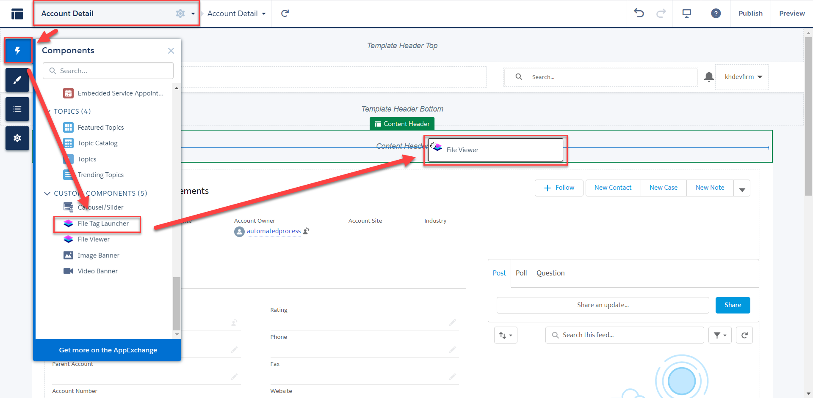

From here you can follow the record page Configuration section above to
configure the components.

# Component Overview

## FileViewer

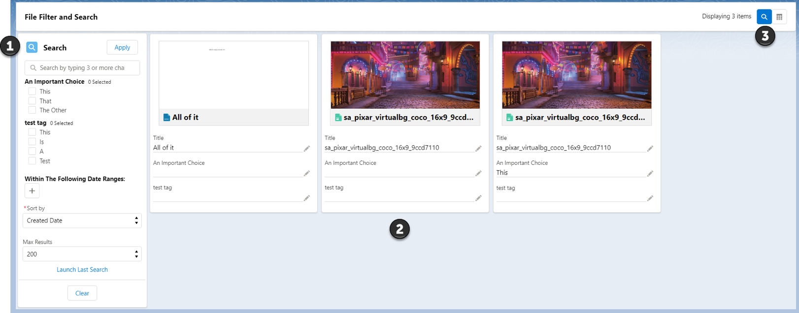

1.  Search Section: The topmost bar will allow you to search any of the
    object allowed to be search from the setup of the component. If
    Search Objects was left blank it will search all objects. The Apply
    button will apply any search elements defined in the search section.

    a.  Each tag is shown in the search section filter documents. Check
        the boxes for the tags you want to filter on the click Apply.

    b.  Clicking the + button below the 'Within The Following Date
        Ranges:' section will result in a date filter section being
        added.\
        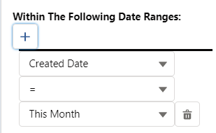\
        This allows you to use the date fields on the Content Version to
        filter. If you choose Custom range, you will be given a date
        picker UI to choose the dates:\
        \
        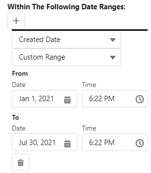\
        This can be added multiple times. Once you add dates to filter
        on click the Apply button.

    c.  Sort By will allow you to sort the searched files by the chosen
        field

    d.  Max results limits the number of results per page by the chosen
        number

2.  Results Section: This is the files returned by your search results.
    Each tile is set up the same way. Clicking one of the edit panels
    will allow the user to edit the file.

    a.  Preview of the Document

    b.  Title of the document

    c.  All tags on the Content Document object

3.  This section will allow you to toggle various aspects of the File
    Viewer page

    a.  This displays the number of records returned form the search.

    b.  Clicking this will toggle the
        search section from visible (blue) to not visible (white)

    c.  Clicking this will toggle the
        results section from list view (blue) to tile view (white)

[]{#_Toc78542078 .anchor}FileTaxonomyLauncher\
\
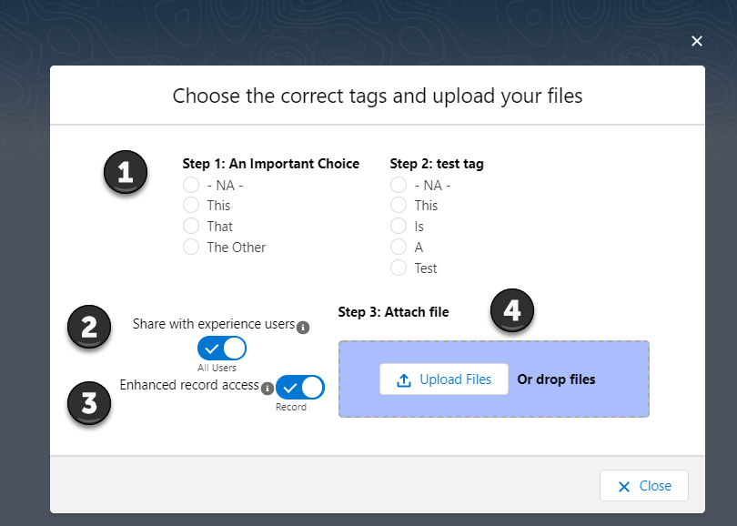

When using this UI please make sure you follow the steps in order (1 -\>
2 -\> 3) to make sure tagging and sharing works correctly with each
file.

1.  This Section Shows you the Tags they can be associated with the
    files uploaded. Make sure to set your tags before you upload the
    file. Tags can be left the same between upload or changed. If you
    use the Upload Files button the set tags will be associated with all
    files uploaded.

2.  This section allows for the user to decide if the uploaded files
    should be shared with all users (All Users) or only internal users
    (Default). This works on a per file bases if drag drop is used or
    with multiple files if using the Upload Files button.

3.  This Section allows for the user to decide if they want to have the
    files shared with inferred sharing from the related records (Record)
    or only if the file should be view only to people with record access
    (viewer). This works on a per file bases if drag drop is used or
    with multiple files if using the Upload Files button.

4.  This is the section where you literally upload the files. You can
    drag drop one file at a time or click the upload files button to
    upload multiple files.
